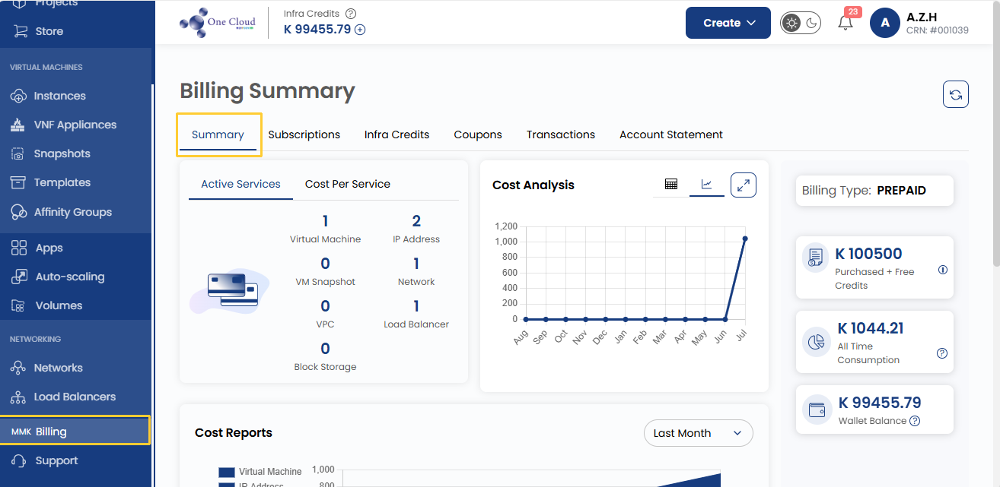
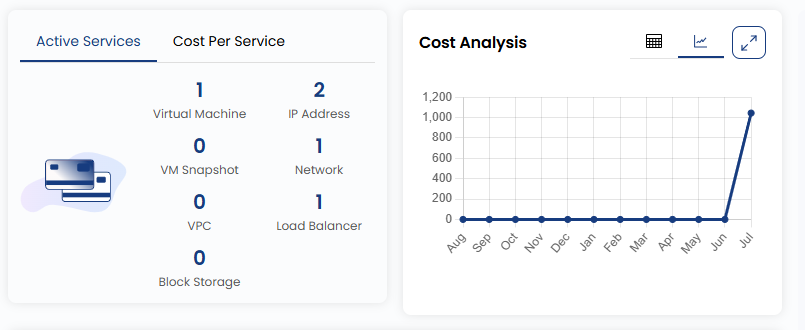
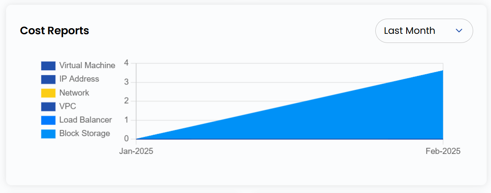
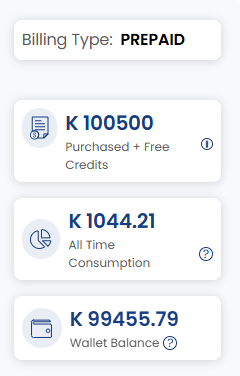
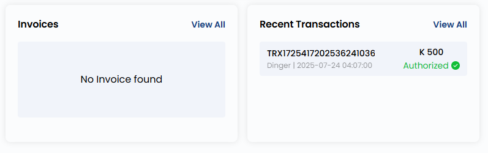

## Billing Summary Guide

This guide provides a step-by-step process for navigating the **Billing Summary** in 1CNG. It covers various billing-related tabs, including Active Services, Cost Analysis, Billing Wallet, Monthly Threshold Limit, Invoices, and more.

- From the left-hand side menu, navigate to **Billing**.
- Click on the **Summary** to access an overview of billing details.

### Active Services

- The **Active Services** section provides a comprehensive summary of active services. It lists the count of Virtual Machines, IP Addresses, Networks, and more.
- The **Cost Per Service** tab displays service-related costs.

### Cost Reports

- Use the **Cost Reports** section to review expenses for each resource in detail.

### Billing Type and Usage

- On the right side of the page, you can check the **Billing Type**, which can be Prepaid or Postpaid.
- You can also check all-time consumption, monthly usage, and projected monthly spending.

### Invoices

- The **Invoices** section allows users to view all invoices related to their account. This includes past invoices, current pending invoices, and details regarding payment due dates. Reviewing invoices regularly ensures that users remain aware of their financial obligations and avoid late payments.

### Recent Transactions

- The **Recent Transactions** section provides a detailed record of all recent financial transactions associated with the account. By reviewing this section, users can maintain transparency in their billing history and track all payments made recently.

