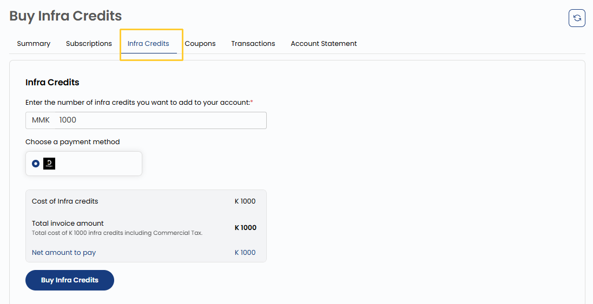

## Payment Methods

**Infra Credits** tab allows users to manage their payment preferences. Users can purchase **Infra Credits** by setting a payment method. To add Infra Credits, users simply enter the desired amount, and the corresponding charge is applied to the default payment method set in their account. This feature helps in maintaining a seamless billing experience without interruptions.

