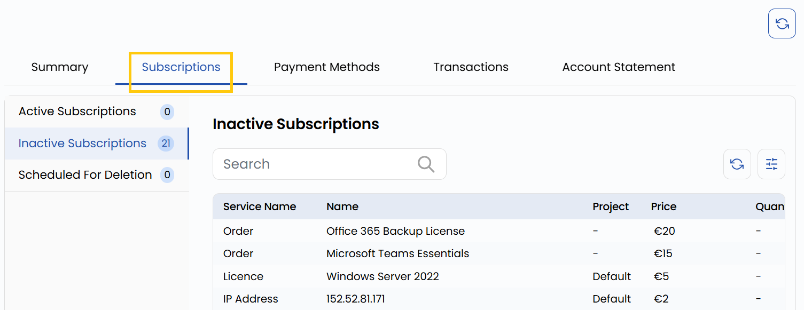

## Subscriptions

The **Subscription** tab allows users to manage and track all their subscribed services. Subscriptions represent the ongoing usage of cloud or infrastructure services and are categorized into three statuses:

- **Active Subscriptions**: These are currently running services that are being billed regularly.
- **Inactive Subscriptions**: These are temporarily disabled services that are not currently billed but can be reactivated.
- **Scheduled for Deletion**: These are services marked for termination and will be removed from the system soon, preventing further billing.

