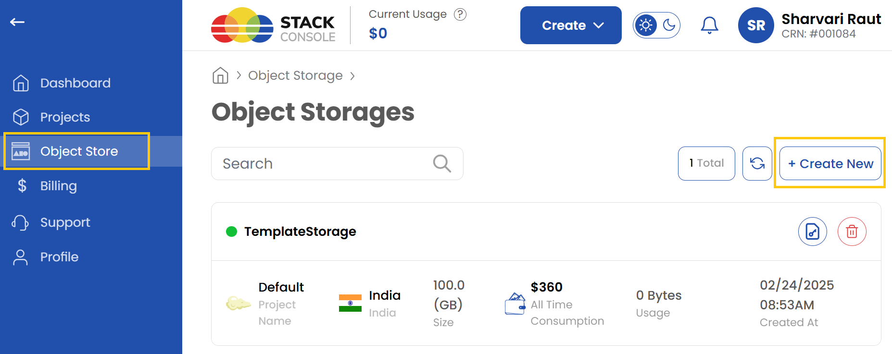
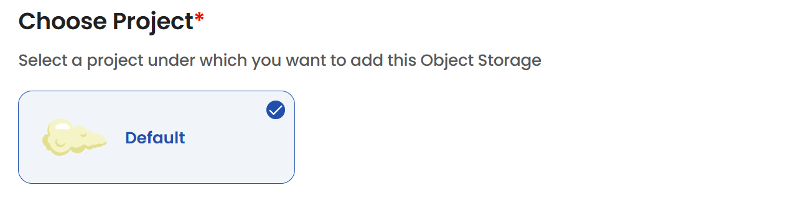
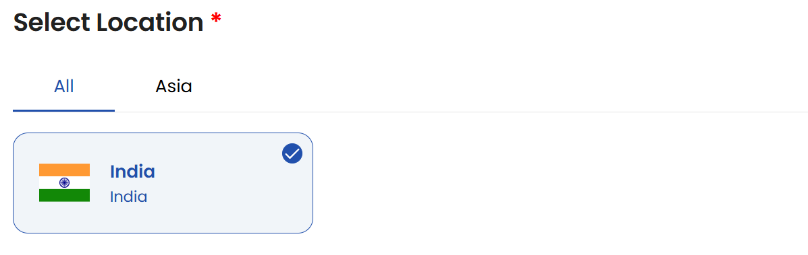
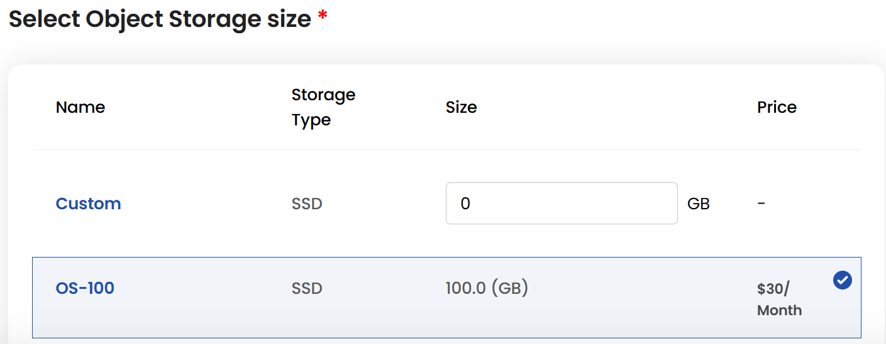
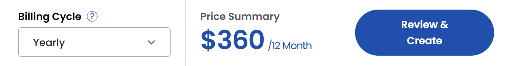

 ## Ceph Object Storage

**Ceph** is a robust and scalable object storage solution designed to provide reliable data storage and management. **Stack Console** offers seamless integration, empowering users to create and manage storage objects efficiently. Here is a step-by-step guide on how you can configure **Ceph Object Storage** within your Stack Console dashboard.

------

### Creating Ceph Object Storage

- From the left-hand side menu, click on the **Object Storage** tab.
- To create an object storage, click the **Create Object Storage** or **Create New** icon located on the right side of the page. This will open the object creation menu.

### Assign to a Project

- Assign the object storage to one of your projects to organize and manage resources effectively.

### Choose a Location

- Select the data center location where your server will be physically hosted.
- Choose from the available locations listed.

### Object Storage Size

- Choose a plan based on your requirements like storage type and size. You can also create a custom plan if needed.
- The cost will adjust according to the resources you select.

### Choose Storage Object Name

- Provide a unique **Object Name** for your storage object to identify it easily in your dashboard.

### Create Storage Object

- Choose the desired **Billing Cycle** for your storage object. Ceph Object supports Hourly, Monthly, Quarterly, Semiannually, Yearly, Bi-annually, and Tri-annually billing cycles. 
- It uses Date to Date, Fixed Calendar Month, Unfixed Calendar Month, Fixed Prorata, and Unfixed Prorata billing rules.
- Multiple configuration options are available. This service provides flexible, scalable object storage for various cloud-native use cases.
- Verify all the configuration details and review the price summary. Click on **Review and Create** to create the storage object.

### Conclusion

By following this guide, you can easily configure and manage **Ceph Object Storage** in Stack Console. This feature provides a scalable and reliable solution for storing and managing your data efficiently. For further assistance, refer to the Stack Console documentation or reach out to support.
