## Managing Ceph Object Storage

Once your Ceph Object Storage is active, use the dashboard to monitor storage performance, capacity usage, and object counts.

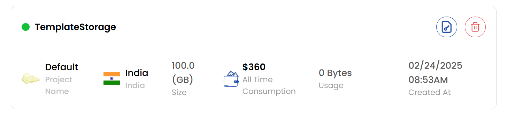

### Actions Buttons

- Action Buttons offer shortcuts for common storage object tasks.
- For quick actions, click the buttons on the right side of the storage instance. You can use these action buttons for quicker tasks.

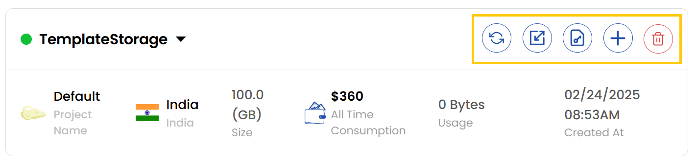

- **Refresh**: Refreshes the storage object status and page information.
- **Auto-scaling**: Auto-scale the storage object.
- **Credentials**: Shows the credentials of the storage object.
- **Resize**: Resizes the storage object.
- **Delete**: Deletes the storage object permanently.

### Auto Scale Storage Bucket

- To auto-scale a storage bucket, click the auto-scaling icon. Toggle the **Auto Scaling** button to enable or disable auto-scaling and click **Submit** to confirm changes.

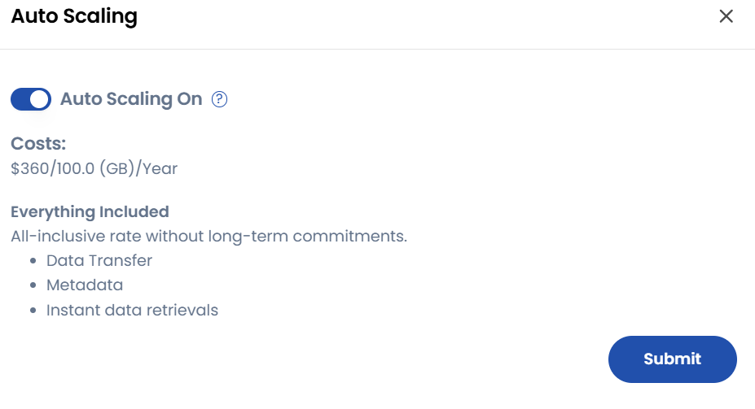

### View Credentials

- To view credentials, click the credentials icon. The **S3 Object Store Credentials** menu will show up. You can view the **Secret Key** and **Password** associated with the storage object.

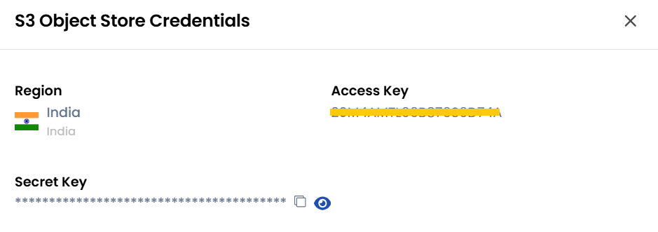

### Resize Object Storage

- To upgrade/downgrade storage size, click the resize icon. The **Resize Object Store** menu will show up. You can customize the object size by increasing or decreasing the size as required.
- Choose the desired **Billing Cycle** for your object storage. You can choose either Hourly or Monthly.
- Verify all the configuration details and review the price summary. Click on **Resize** to resize the object.

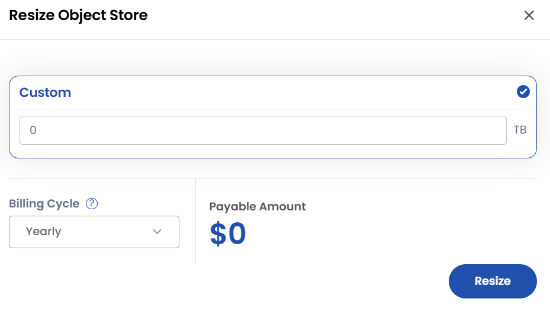

### Create Storage Bucket

- Click on **Create Bucket** to create a new bucket.

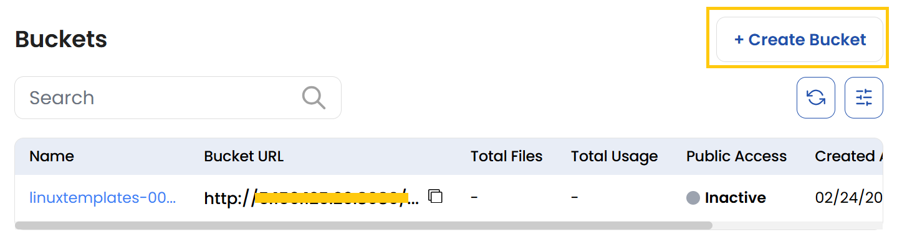

- Enter a **Bucket Name** and enable **Bucket Versioning** if needed. Bucket versioning allows you to retrieve and store previous versions of an object.

:::note

- Note that object locking requires bucket versioning to be enabled.
- Versions of objects are added to your total data storage costs.

:::

- Optionally, enable **Object Locking** to protect objects from deletion or overwriting for a fixed period. 
- Store objects using a write-once-read-many (WORM) model to prevent objects from being deletd or overwritten for a fixed amount of time or indefinitely. 
- Click **Create** to finalize the bucket creation.

:::note

- Object Locking works only in versioned buckets.

:::

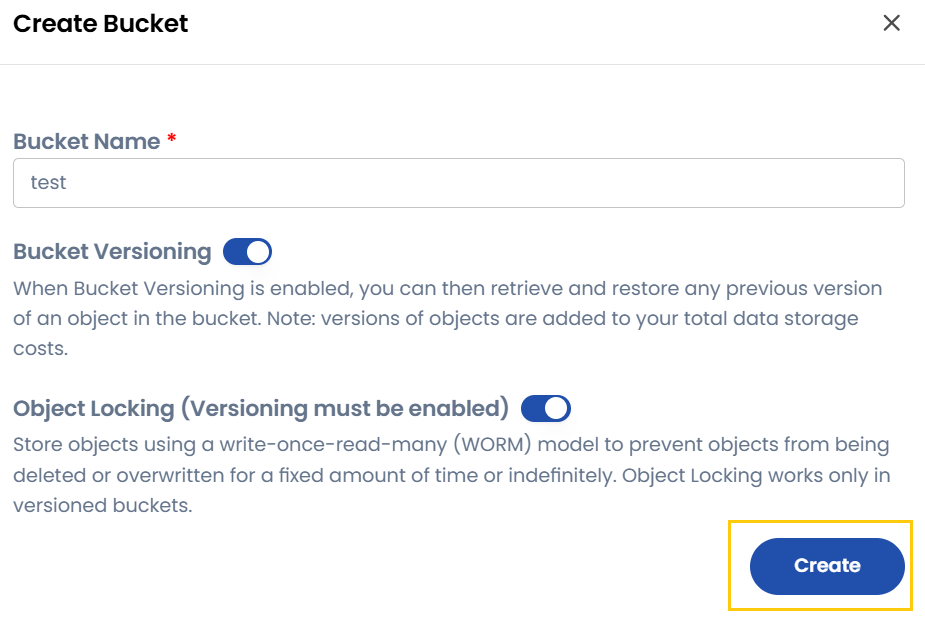

### Storage Bucket Overview

- To view bucket details, click on the bucket name to see total files, bucket URL, usage, creation date, and public access settings.

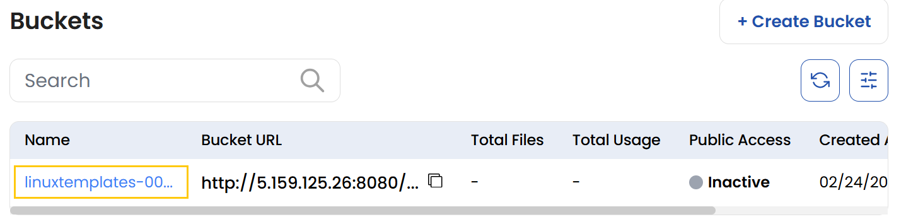

- Utilize the Quick Actions to share, update, or delete a bucket. To share a bucket, click on the share icon. You can enable public sharing.

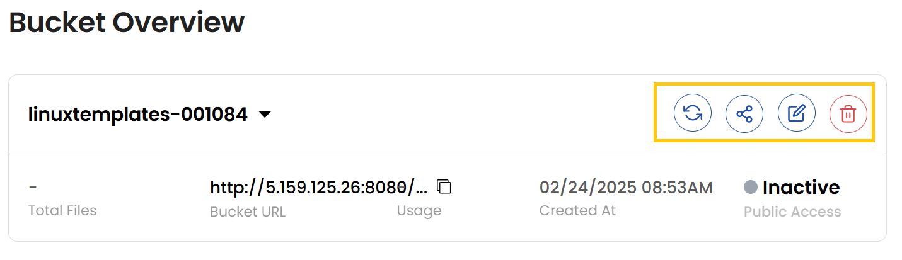

- When public sharing is enabled, anybody with the object's link can access it without requiring specific permissions. This configuration may be applied to individual files or the entire bucket, providing access via conventional HTTP or HTTPS queries. Click on **Update** to save changes.

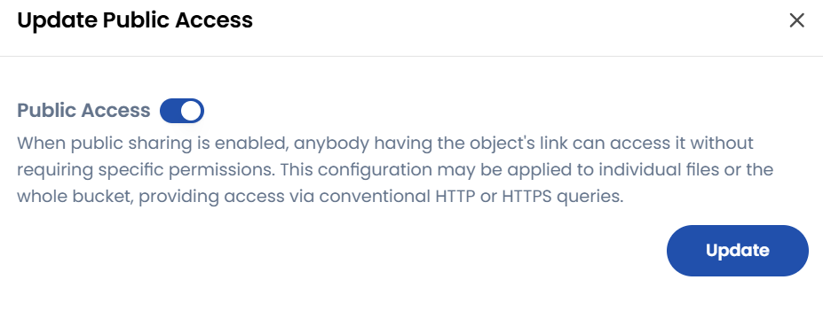

- Within each bucket, you can create folders or upload files using the **Upload Files** or **Create Folder** icons.

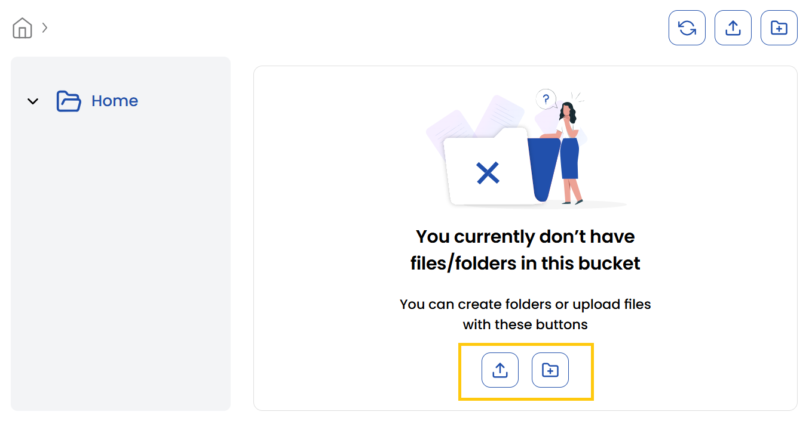

### Conclusion

By following this guide, you can effectively manage your Ceph Object Storage, including auto-scaling, resizing, creating buckets, and monitoring usage. These features ensure optimal performance, scalability, and security for your storage needs. For further assistance, refer to the Stack Console documentation or reach out to support.
