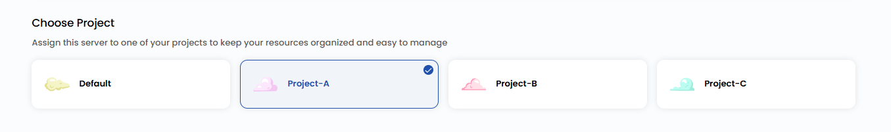
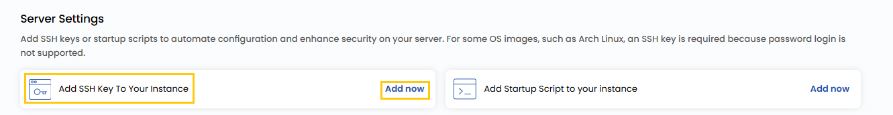
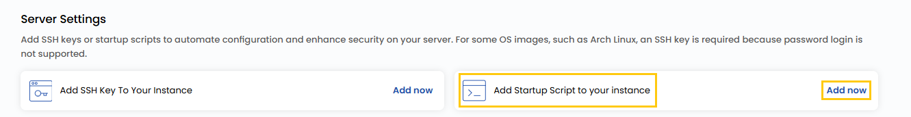

## Compute Instance

A Compute Instance is a virtual server in the cloud that functions similarly to a physical computer. It has its own CPU, memory, and storage, allowing you to install software, run applications, or host websites. With a Compute Instance, you have complete control over your server environment, making it flexible for various tasks. Compute Instances are a fundamental component of cloud services, enabling users to quickly launch and scale servers as needed.

----------

## Creating a Compute Instance on Stackconsole

This guide provides you the step-by-step instructions for creating a cloud server instance, which offers flexible and scalable computing power for running applications, managing volumes, and adapting resources to your needs.

- From the left-hand menu, click on the **Instances** tab.
- You will be redirected to the **Instances** page.

- To create click the **plus (+)** icon located on the right side of the Instances page. This will open the Instance creation page.

### Choose a Location

- Select the data center location where your server will be physically hosted.
- Choose from the available locations listed.

### Choose an Image

- Select an operating system or application template to install on your server.
- Available options include popular OS images, alternatively you can import a custom ISO.
- **Note**: For Microsoft Windows, only official evaluation versions are available.

    
### Choose the Type of CPU allocation
    
- Select the CPU resource allocation that fits your workload:

    - **Shared CPU** instances are affordable, with resources shared among users, making them ideal for development, testing, and low-performance workloads like small websites.

    - **Dedicated CPU** instances provide exclusive resources for consistent performance, perfect for production environments, high-traffic applications, and databases.

    - **High-Frequency Compute** servers offer high clock speeds for compute-intensive tasks like simulations, financial modeling, and low-latency applications.

    - **Cloud GPU** instances deliver GPU acceleration for demanding tasks like machine learning, AI, video rendering, and scientific simulations.
        
### Choose a Plan

- Choose a plan based on your requirements like CPU, Memory, Storage and Bandwidth. You can also create a custom plan if needed. 
- These are some available options and their plans:

    - **General Compute (GC)**: These plans are designed for balanced workloads, General Compute plans offer a mix of CPU, memory, storage, and bandwidth, making them ideal for most general-purpose applications, web servers, and testing environments.

    - **Compute Optimized (CO)**: These plans prioritize CPU performance, perfect for compute-intensive tasks like batch processing, analytics, and high-speed processing workloads requiring maximum computational power.

    - **Memory Optimized (RO)**: These plans are tailored for applications requiring high memory capacity, such as in-memory databases, big data processing, and real-time caching systems.

    - **Database Optimized (DO)**: These plans are specifically tuned for database workloads, offering enhanced I/O performance and memory-to-disk ratio for handling transactional or analytical database systems.

### Assign to a Project

- You can choose projects to assign the server to one of your projects to organize and manage resources effectively.

### Choose a Network
    
- Select the network for your Instance depending on your connectivity and security needs. For more details about available network options, refer to the respective network guides.

- **Public Network**: The Public Network is a simple, pre-configured network designed for external connectivity with essential built-in features. It includes cloud firewall protection for securing your server, port forwarding for directing traffic to specific applications, and remote access VPN for securely managing your instance. This option is ideal for users who require straightforward, hassle-free connectivity without the need for advanced customization.

- **VPC Network**: The Virtual Private Cloud (VPC) Network is an advanced networking solution offering complete control over traffic routing and enhanced security. It supports features like VPN gateway, site-to-site VPN connections, and traffic segregation to isolate workloads for better security and performance. 

    **Note:** By default, a VPC is created with a random **CIDR** block and one network tier, making it a robust option for enterprises and users with complex, customizable networking needs.

- You can choose whether to enable public IPv4 for internet access to your server.

### Configure Server Settings

- Configure additional settings for your server.
- You can **Add SSH Key** for secure access. Click on **Add Now** to add SSH key.
- **Note:-** For some OS images, such as Arch Linux, an SSH key is required because password login is not supported.

- Add Name of the SSH key with the Key value and click on **Add SSH Key**.

- Add a startup script to automate specific actions during instance initialization. Click on **Add Now** to add startup script for your instance.

### Advanced Settings (Optional)

- The Advanced Settings section allows you to configure additional VM settings for optimized performance, security, and flexibility Configure advanced settings by enabling the **Advance Mode**.

-   **Boot Mode**: Select Legacy or Secure boot for system startup security.
-   **Boot Type**: Choose between UEFI (modern firmware) or BIOS (traditional firmware).
-   **Enable Dynamic Scaling** – Allows automatic resource scaling based on workload demands.
        
### Server Hostname

- Provide a unique **Server Name** and a valid **Server Hostname** for your Instance to identify them easily in your dashboard.

        
### Review and Deploy

- Choose the desired **Billing Cycle** for your Instance. You can choose either Hourly or Monthly cycle.
- Verify all the configuration details and review the price summary. Click on **Review & Deploy** to create the Instance.     

----------

## Next Steps

From the **Instance Overview** menu, you can further customize and manage your virtual machine. Here are some common tasks:

-   **Connect with SSH**
    
-   **Connect with RDP**
    
-   **Access via Console**
    
-   **Modify VM Settings**
    
-   **Monitor Resource Usage**
    

For more detailed instructions on these features, refer to their respective guides in the Stackconsole documentation for Apache CloudStack.