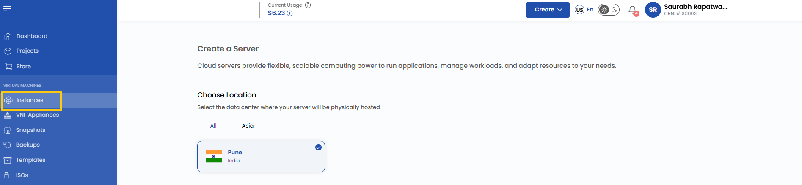
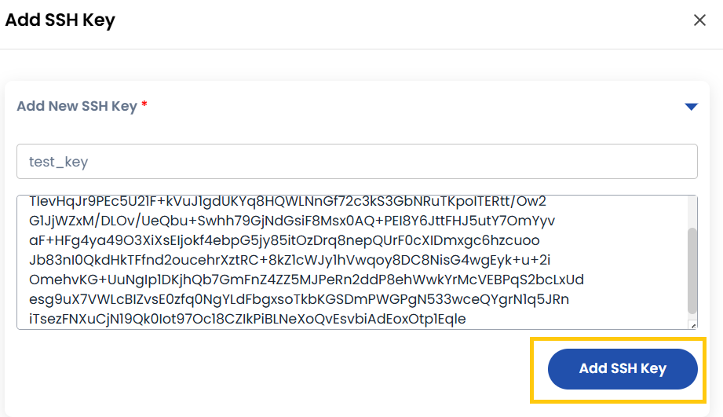
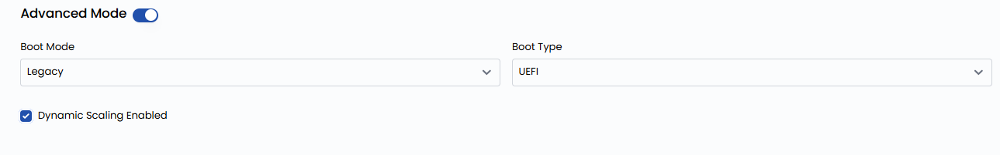

## Compute Instance

A **Compute Instance** is a virtual server in the cloud that functions similarly to a physical computer. It has its own CPU, memory, and storage, allowing you to install software, run applications, or host websites. With a Compute Instance, you have complete control over your server environment, making it flexible for various tasks. Compute Instances are a fundamental component of cloud services, enabling users to quickly launch and scale servers as needed.

----------

### Creating a Compute Instance on Stack Console

This guide provides step-by-step instructions for creating a cloud server instance, which offers flexible and scalable computing power for running applications, managing volumes, and adapting resources to your needs.

- From the left-hand menu, click on the **Instances** tab.
- You will be redirected to the **Instances** page.

- To create an instance, click the **plus (+)** icon located on the right side of the Instances page. This will open the Instance creation page.

### Choose a Location

- Select the data center location where your server will be physically hosted.
- Choose from the available locations listed.

### Choose an Image

- Select an operating system or application template to install on your server.
- Available options include popular OS images. Alternatively, you can import a custom ISO.
- **Note**: For Microsoft Windows, only official evaluation versions are available.

### Choose the Type of CPU Allocation

- Select the CPU resource allocation that fits your workload:

  - **Shared CPU**: Affordable, with resources shared among users. Ideal for development, testing, and low-performance workloads like small websites.
  - **Dedicated CPU**: Provides exclusive resources for consistent performance. Perfect for production environments, high-traffic applications, and databases.
  - **High-Frequency Compute**: Offers high clock speeds for compute-intensive tasks like simulations, financial modeling, and low-latency applications.
  - **Cloud GPU**: Delivers GPU acceleration for demanding tasks like machine learning, AI, video rendering, and scientific simulations.

### Choose a Plan

- Choose a plan based on your requirements like CPU, memory, storage, and bandwidth. You can also create a custom plan if needed.

  - **General Compute (GC)**: Balanced workloads with a mix of CPU, memory, storage, and bandwidth. Ideal for general-purpose applications, web servers, and testing environments.
  - **Compute Optimized (CO)**: Prioritizes CPU performance for compute-intensive tasks like batch processing, analytics, and high-speed processing workloads.
  - **Memory Optimized (RO)**: Tailored for applications requiring high memory capacity, such as in-memory databases, big data processing, and real-time caching systems.
  - **Database Optimized (DO)**: Specifically tuned for database workloads, offering enhanced I/O performance and memory-to-disk ratio for transactional or analytical database systems.

### Assign to a Project

- Assign the server to one of your projects to organize and manage resources effectively.

### Choose a Network

- Select the network for your instance based on your connectivity and security needs. For more details about available network options, refer to the respective network guides.

  - **Public Network**: A simple, pre-configured network designed for external connectivity. Includes cloud firewall protection, port forwarding, and remote access VPN. Ideal for users who require straightforward, hassle-free connectivity.
  - **VPC Network**: A Virtual Private Cloud (VPC) offering complete control over traffic routing and enhanced security. Supports VPN gateway, site-to-site VPN connections, and traffic segregation for better security and performance.

  **Note:** By default, a VPC is created with a random **CIDR** block and one network tier.

- You can choose whether to enable public IPv4 for internet access to your server.

### Configure Server Settings

- Configure additional settings for your server:
  - **Add SSH Key** for secure access. Click on **Add Now** to add an SSH key.
  - **Note**: For some OS images, such as Arch Linux, an SSH key is required because password login is not supported.

- Add the name of the SSH key with the key value and click **Add SSH Key**.

- Add a startup script to automate specific actions during instance initialization. Click on **Add Now** to add a startup script.

### Advanced Settings (Optional)

- Configure additional VM settings for optimized performance, security, and flexibility by enabling **Advanced Mode**.

  - **Boot Mode**: Select Legacy or Secure boot for system startup security.
  - **Boot Type**: Choose between UEFI (modern firmware) or BIOS (traditional firmware).
  - **Enable Dynamic Scaling**: Allows automatic resource scaling based on workload demands.

### Server Hostname

- Provide a unique **Server Name** and a valid **Server Hostname** for your instance to identify it easily in your dashboard.

### Review and Deploy

- Choose the desired **Billing Cycle** for your instance. You can choose either Hourly or Monthly.
- Verify all the configuration details and review the price summary. Click on **Review & Deploy** to create the instance.

----------

### Conclusion

Creating a Compute Instance on Stack Console is a straightforward process that provides you with the flexibility and scalability needed to meet your computing requirements. By following this guide, you can configure your instance to suit your specific needs, whether for development, production, or specialized workloads. Regularly review and optimize your instance settings to ensure efficient resource utilization and enhanced performance. For further assistance, explore the Stack Console documentation or reach out to support.
