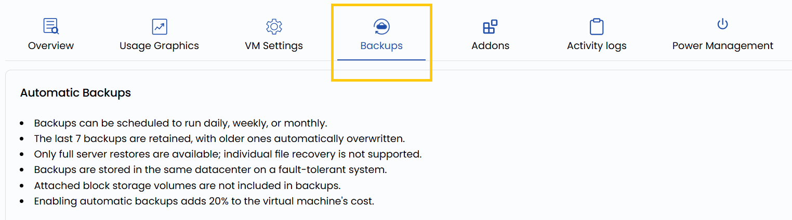

## Instance Backup in Stack Console

**Backups** create copies of your instance’s data to protect against accidental deletions, software failures, or security threats. By enabling backups, you ensure that a restorable version of your VM is always available if needed. 

**Stack Console** provides automated backup options on a daily, weekly, or custom schedule, allowing for seamless data recovery without manual intervention. Implementing backups is crucial for safeguarding your data and reducing downtime in case of unexpected issues.

- To automatically backup instance, go to the **Backups** tab.
- The **Backups** provides a to set automatic backups of the instance or yo can schedule backup for sometime.

