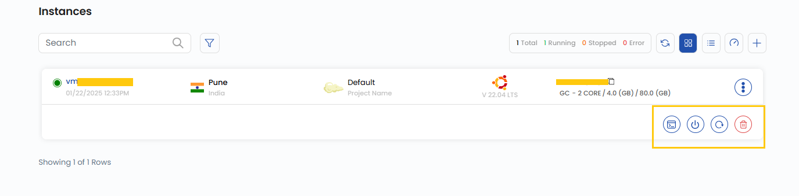

## Instance Overview

The **Instance Overview** page provides a detailed summary and management options for your virtual machine (VM) instance. It includes information about the instance status, location, operating system, performance, and quick actions for managing the instance.

----------

### Action Buttons

- Action Buttons offers shortcuts for common VM management tasks.
- For quick actions, click on the three dots on right side to open the actions. You can use these action buttons for quicker tasks.

 

- To view more Action buttons in detail. Click on the instance that will redirect to the **Virtual Machine Overview** page.

-   **Refresh:** Refreshes the instance status and page information. 
-   **Console Access:** Opens a console interface to interact with the VM directly.
-   **VM Volume Snapshots:** Displays a list of existing snapshots or allows you to take a snapshot of the current state of the VM for backup or future restoration.
-   **Power Off:** Shuts down the virtual machine.
-   **Reboot:** Restarts the instance.
-   **Attach ISO for VM:** Mounts an ISO file to the VM, allowing installation or recovery operations.
-   **Delete:** Deletes the instance permanently.
    

### Instance Information

 

-   **Instance Name:** Displays the name of the instance.
-   **Created on:** Shows the creation date and time.
-   **Status:** Indicates the current running status of the VM.

### Instance Details

 

-   **Location:** Indicates the datacenter location of the instance.
-   **Operating System:** Displays the OS running on the VM.
-   **Cost:** Shows the all-time consumption cost for the VM.    

### Resource Specifications

 

-   **Label:** Custom label associated with the VM.
-   **CPU:** Number of vCPUs allocated.
-   **RAM:** Amount of memory available to the instance.
-   **Disk Size:** Size of the storage disk.
-   **Public IP Address:** The public IP assigned to the instance.
-   **Private IP Address:** The internal IP used in the network.
-   **Network:** Displays the associated network.
-   **Username:** Default login username for the instance.
-   **Password:** VM instance Password.
-   **Affinity Group:** Defines VM placement rules within a specific group for optimized performance.
-   **Tag:** Labels used for categorization and organization. To add a Tag, click **Add Tag**, enter a Key and Value, then click **Submit**.    

### Resource Usage

- Resource Usage helps to Monitor resource usage like CPU, RAM, disk, and network usage over time.

 

-   **Disk Size:** Shows the disk usage capacity.
-   **Network Traffic:** Provides metrics on network usage over a specified period (defaulted to the Last 24 Hours).
-   **CPU Usage:** Shows the percentage of CPU resources currently being used.
-   **RAM Usage:** Displays the amount of memory consumption by the instance.
    

This overview page provides a comprehensive yet straightforward view of the VM instance’s configuration and management options. Each action button allows quick control over the VM's status, while resource specifications help monitor the VM's performance and behavior.