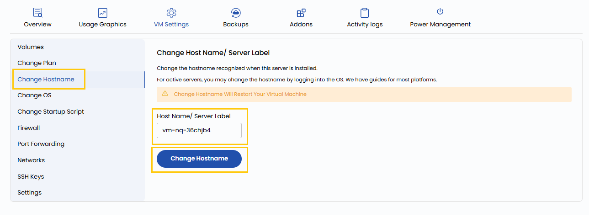

## Change Hostname Settings

The hostname is the unique identifier for your virtual machine within the network. With this setting, you can modify the VM’s hostname to suit your organizational standards or project requirements. Changing the hostname can help with better identification, integration into domain services, or alignment with specific naming conventions.

----------

- To change hostname go to the **VM settings** and navigate to the **Change Hostname** section.  
- Enter new hostname and click on **Change Hostname**.

----------

### Conclusion

Changing the hostname of your virtual machine is a simple yet important step in maintaining clarity and consistency in your infrastructure. It enhances identification, supports domain integration, and aligns with naming policies. Make sure the new hostname adheres to your internal standards and is applied across your environment for uniformity.
