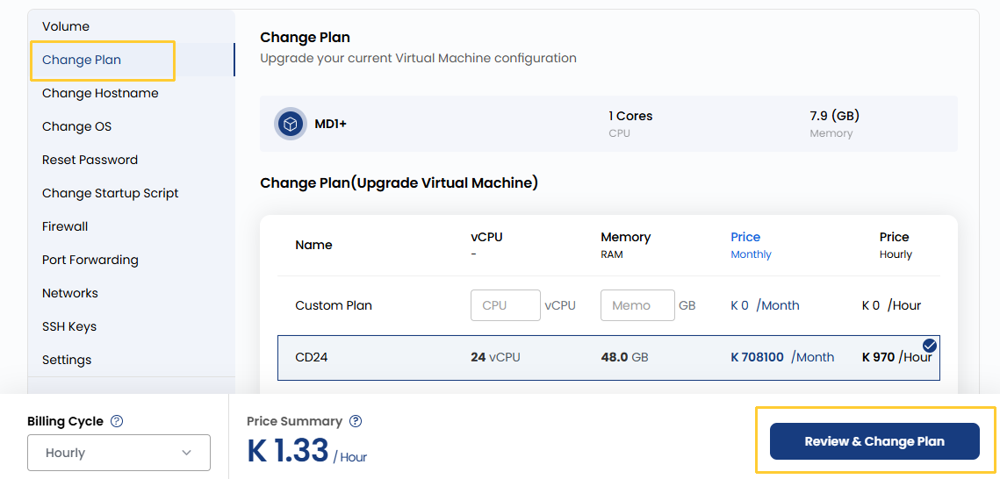

## Change VM Plan

With this option, you can upgrade or downgrade your VM’s resource allocation, such as CPU cores, RAM, and storage. This is useful when your resource requirements change over time, like scaling up for higher performance during peak usage or scaling down to save costs when fewer resources are needed. The plan change process may involve a reboot of the VM.

----------

- To change your payment plan, go to the **VM settings** and navigate to the **Change Plan** section.  
- Select from the available options or create a custom plan based on your needs.

:::warning

Downgrading is currently not supported. Shrinking the hard disk is not possible without risking data loss.

:::

- Once you have made your selection, review the details to ensure they meet your requirements and click on **Review and Change Plan** to apply new plan. 

----------

### Conclusion

Adjusting your VM’s plan allows you to scale resources efficiently based on real-time needs. Whether you're optimizing for performance or cost, changing plans ensures your infrastructure remains aligned with your business objectives. Be sure to review the plan details and be aware that some changes may require a VM reboot.
