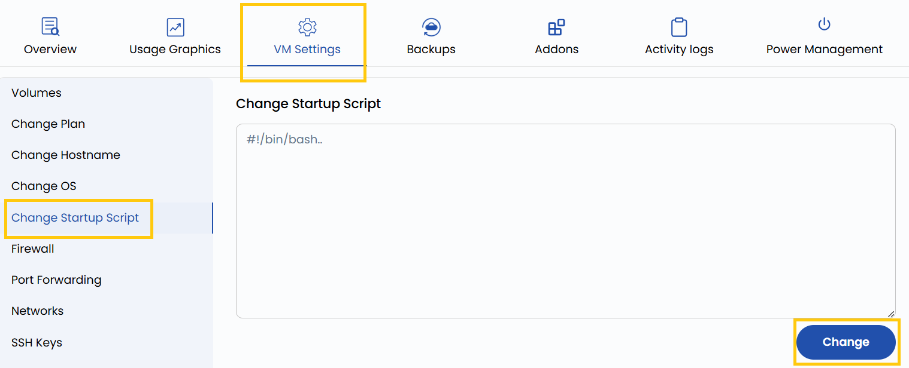

## Change Startup Script

Startup scripts are executed automatically when the virtual machine is initialized or rebooted. This setting allows you to update or replace the script used to configure the VM during these events. Common use cases include installing software, applying system updates, or setting up application-specific configurations.

----------

- To change your startup script, go to the **VM settings** and navigate to the **Change Startup Script** section.  
- Add your desired script and click on **Change**.

----------

### Conclusion

Modifying the startup script empowers you to automate key configurations each time your VM boots up. Whether it's deploying software or initializing environment variables, a well-crafted script ensures consistency and efficiency in your virtual machine operations. Always review your script syntax before applying changes to avoid boot-time errors.
