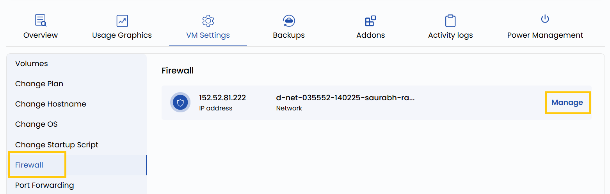

## Firewall Configuration

The Firewall setting provides a way to define security rules for incoming and outgoing network traffic to your virtual machine. You can allow or deny access to specific IP addresses, ports, or protocols. For example, you might block all traffic except for SSH (port 22) and web traffic (port 80/443). This is essential for securing your VM against unauthorized access.

----------

- To change and manage your firewall configurations, go to the **VM settings** and navigate to the **Firewall** section.  
- Click on **Manage** to change firewall configurations for that network.

----------

### Conclusion

Proper firewall configuration is critical for maintaining the security and integrity of your virtual machines. By setting precise rules for allowed and blocked traffic, you minimize potential attack surfaces and ensure that only trusted connections are permitted. Regularly audit your firewall settings to keep them aligned with your security policies.
