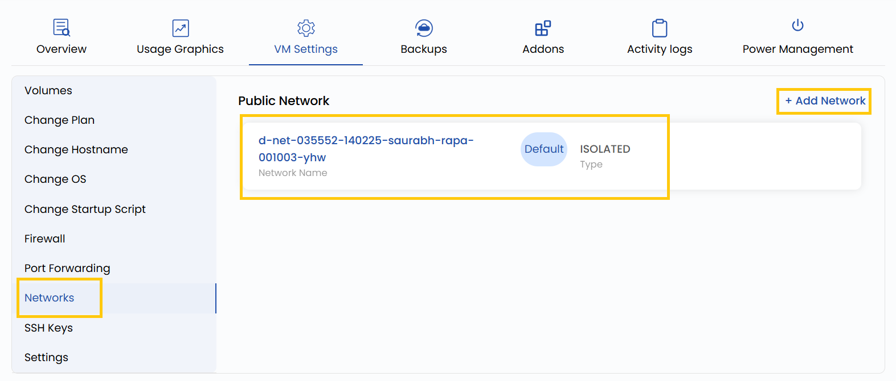

### **Networks**

This setting allows you to manage the VM’s network interfaces, including configuring private and public network options. Private networks are used for communication between your virtual machines without exposing them to the internet, while public networks provide external IP addresses for internet access. You can also adjust bandwidth limits and assign or remove IP addresses.

- To add or change your network configurations, go to the **VM settings** and navigate to the **Networks** section.
- Click on **Add Network** to add network and click on the network to change the configuartions for that network.

