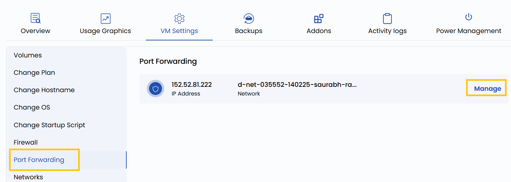

### **Port Forwarding**

Port Forwarding enables you to redirect traffic from a specific port on your host machine or public IP to a port on your VM. For example, you can forward external traffic on port 8080 to port 80 on your VM for web server access. This is useful for exposing services running on your VM to the outside world while keeping the configuration flexible.

- To redirect traffic of the network, go to the **VM settings** and navigate to the **Port Forwarding** section.
- Click on **Manage** to change port configuartions for that network.

