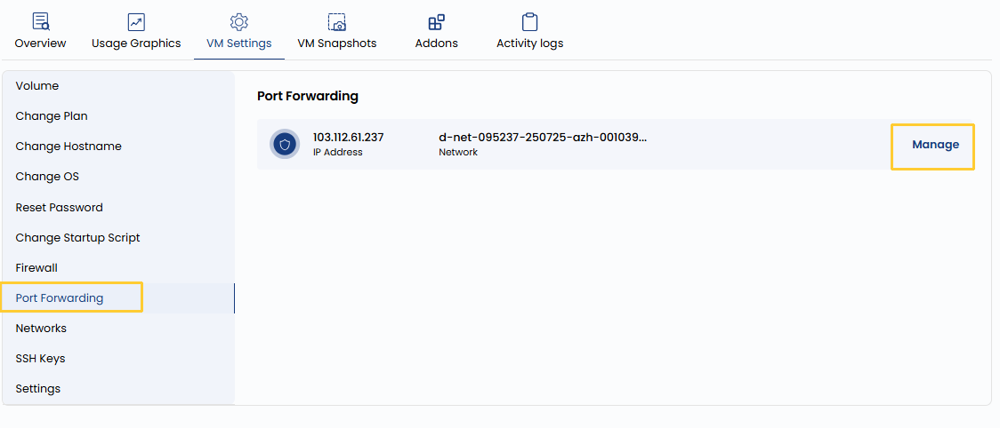

## Port Forwarding

Port Forwarding enables you to redirect traffic from a specific port on your host machine or public IP to a port on your VM. For example, you can forward external traffic on port 8080 to port 80 on your VM for web server access. This is useful for exposing services running on your VM to the outside world while keeping the configuration flexible.

----------

- To redirect traffic of the network, go to the **VM settings** and navigate to the **Port Forwarding** section.  
- Click on **Manage** to change port configurations for that network.

----------

### Conclusion

Port forwarding is a powerful feature for enabling external access to services hosted on your VM. Whether you're running a web server, SSH service, or a custom application, proper configuration allows seamless and secure connectivity. Always verify the port rules to avoid conflicts and ensure only necessary ports are exposed.
