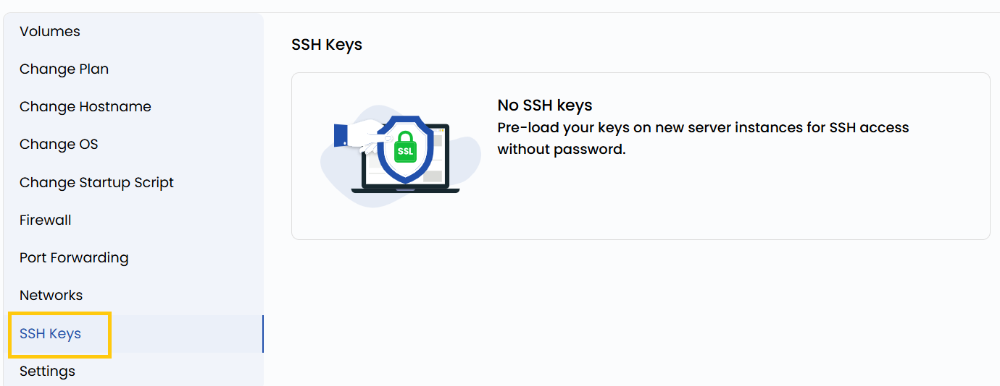

## SSH Key Access

SSH keys provide a secure, passwordless way to access your virtual machine. This setting allows you to view SSH public keys authorized to log in to the VM. By using key-based authentication, you eliminate the need to remember passwords and reduce the risk of unauthorized access from brute-force attacks.

----------

- To view SSH key, go to the **VM settings** and navigate to the **SSH Keys** section.

:::warning

You need to stop the Instance to perform reset SSH Key operation.

:::

----------

### Conclusion

SSH key authentication offers a more secure and efficient alternative to traditional password-based logins. By managing your authorized keys through the VM settings, you ensure controlled access to your instance. Regularly audit your SSH keys to maintain a secure environment and revoke any unused or outdated keys.

:::tip
**See also:**  
- **[Connect With SSH](../Connect%20With%20SSH.md)**  
:::
