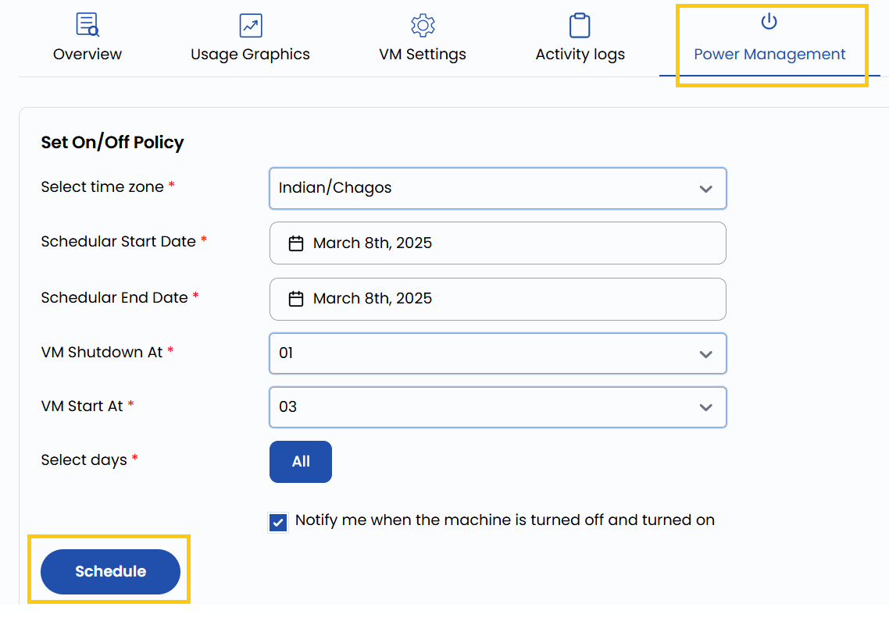

## Power Management for Stack Console

Stack Console's **Power Management** is a feature that allows users to control the power state of their virtual machine (VM) instances efficiently. This feature is designed to help manage resources, reduce costs, and improve system performance by automating VM power schedules.

------

- To monitor resources, go to the **Power Management** tab.
- The **Power Management Page** provides options to set on/off policies or schedule them for later.

### Configure Power Management

- Select the appropriate **Time Zone** to ensure scheduling aligns with your region's time.
- Choose the **Start Date** when the power management policy should begin and the **End Date** if you want the policy to automatically stop at a specific date.
- Specify the **Start Time/Stop Time** when the VM should power on/off.
- Select **All Days** or specify particular days like Monday to Friday.
- Turn on the **Notify me when the machine is turned on/off** option for alerts.
- Click **Schedule** to confirm and activate the power management policy.

### Conclusion

By using the **Power Management** feature in Stack Console, you can efficiently manage the power states of your virtual machines, reducing costs and optimizing resource usage. Automating power schedules ensures that your VMs are only active when needed, improving overall system performance. For further assistance, refer to the Stack Console documentation or reach out to support.
