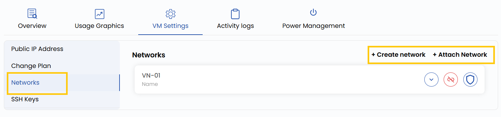
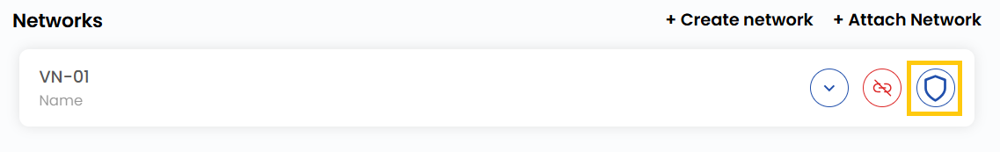

## Network Configuration

This setting allows you to manage the VM’s network interfaces, including configuring private and public network options. Private networks are used for communication between your virtual machines without exposing them to the internet, while public networks provide external IP addresses for internet access. You can also adjust bandwidth limits and assign or remove IP addresses.

----------

- To add or change your network configurations, go to the **VM settings** and navigate to the **Networks** section.  
- Click on **Create Network** to create a network. You can check the Networks guide for a detailed explanation.  
- Click on **Attach Network** to attach a network and select the desired network. Click on the network to change the configurations for that network.

- To add a security group, click on the rightmost icon. Select the security group from the list and click on **Submit**.

----------

### Conclusion

Effectively managing VM network settings ensures secure and optimized connectivity for your workloads. Whether you're setting up internal communication or public access, proper configuration of networks and security groups helps maintain performance and protection. Refer to the associated network guides for deeper customization.

:::tip
**See also:**  
- **[Virtual Network](../../../Networks/Guides%20For%20OpenNebula/Virtual%20Networks.md)**  
- **[Security Group](../../../Networks/Guides%20For%20OpenNebula/Security%20Groups.md)**  
:::
