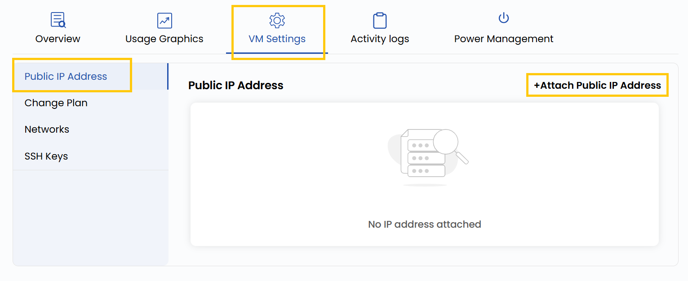

## Manage Public IP Address

This section allows you to manage the public IP addresses associated with your virtual machine. Assigning a public IP enables your VM to communicate with external networks, making it accessible over the internet. This is essential for hosting web applications, SSH access, or any service that requires external connectivity.

----------

- To add or change your public IP address configurations, go to the **VM settings** and navigate to the **Public IP Address** section.

:::warning

Choose a held IP address if you want to use it, or leave it blank to get a new one

:::

- Click on **Attach Public IP Address** to assign a public IP from the available network pool.

- Select a held public IP address and choose the associated network.
- Choose the desired **Billing Cycle** for your IP. You can select either **Hourly** or **Monthly** depending on your usage needs.
- Click on **Submit** to complete the configuration.

----------

### Conclusion

Attaching a public IP address allows your virtual machine to be reachable from the internet. Make sure to configure firewall and security group settings accordingly to ensure your instance remains secure.

:::tip
**See also:**  
- **[IP Addresses](../../../Networks/Guides%20For%20OpenNebula/IP%20Addresses.md)**  
:::
