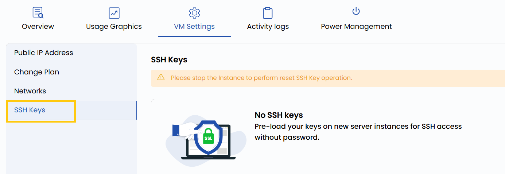

### **SSH Keys**

SSH keys provide a secure, passwordless way to access your virtual machine. This setting allows you to manage (add, remove, or update) SSH public keys authorized to log in to the VM. By using key-based authentication, you eliminate the need to remember passwords and reduce the risk of unauthorized access from brute-force attacks.

- To add or change SSH key, go to the **VM settings** and navigate to the **SSH Keys** section.

