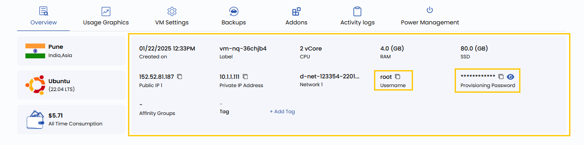

## Accessing Windows VMs via RDP Using Stack Console

**Remote Desktop Protocol (RDP)** enables you to securely connect to and manage your Windows Virtual Machine (VM) remotely. This guide provides a step-by-step process to access your Windows VM via RDP using Stack Console by retrieving the necessary credentials and establishing a secure connection.

-----

### Access the Instance Overview

- From the left side menu, locate and click on **Instances**. 
- From **Virtual Machine Instance** page, select the VM instance you want to access.
- In the **VM Overview** tab, find the **Username** and **Password** fields and copy them for later use.

### Launch the RDP Client

To connect to the VM, open an RDP client on your local machine:

- **Windows**: 
  - Press Win + R, type `mstsc`, and press Enter.
  - Alternatively, search for **Remote Desktop Connection** in the Start menu.

- **MacOS**:
  - Download **Microsoft Remote Desktop** from the Mac App Store if not already installed.
  - Open the Microsoft Remote Desktop application.

- **Linux**:
  - Install an RDP client such as **Remmina** (if not installed, run `sudo apt install remmina` on Ubuntu/Debian-based systems).
  - Open Remmina and select **RDP** as the connection protocol.

### Connect to the Windows VM

- To open the RDP Client, launch the Remote Desktop Connection tool on your local machine.
- Find the **Public IP Address** of your VM in the Stack Console **Overview** tab.
- Provide the **Public IP Address** in the RDP client.
- When prompted, enter the **Username** and **Password** you copied from Stack Console.
- If a security warning appears about the identity of the remote machine the check the **"Don't ask me again for connections to this computer"** and click **Yes**.
- To initiate the connection, click **OK** or **Connect** to establish the remote session.

### Managing Your Windows VM

Once connected to your VM via RDP, you can now:

- Fully control the Windows VM as if using it physically.
- Install software and configure system settings.
- Transfer files between your local machine and the VM using copy-paste or shared folders.

### Conclusion

By following this guide, you can easily connect to and manage your Windows VM using Remote Desktop Protocol (RDP) via Stack Console. RDP provides a secure and efficient way to access your virtual machines, enabling you to perform administrative tasks, install software, and transfer files seamlessly. For further assistance, refer to the Stack Console documentation or reach out to support.

:::tip
**See also:**  
- **[Connect With SSH](./Connect%20With%20SSH.md)**  
- **[Console Access](./Console%20Access.md)**  
:::
