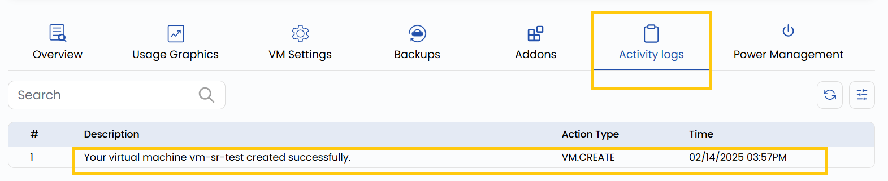

## Monitor Activity for VM in Stack Console

The VM Instance Activity Log in Stack Console provides a detailed record of all actions and events related to a Virtual Machine Instance. This helps in monitoring and performance analysis for managing VM instances.

- To view activity logs for the instance, go to the **Activity logs** tab.
- You can track when a VM instance was created, stopped, deleted, rebooted, and more. 

 