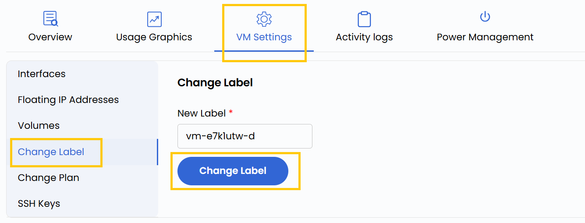

## Change VM Label

The label is the unique identifier for your virtual machine within the network. With this setting, you can modify the VM’s label to suit your organizational standards or project requirements. Changing the label can help with better identification, or alignment with specific naming conventions.

----------

- To change hostname, go to the **VM settings** and navigate to the **Change Label** section.  
- Enter the new hostname and click on **Change Label**.

----------

### Conclusion

Modifying your VM label is a simple but effective way to maintain clarity and consistency across your cloud infrastructure. Whether organizing resources by environment, department, or function, using clear labels improves manageability and collaboration.

