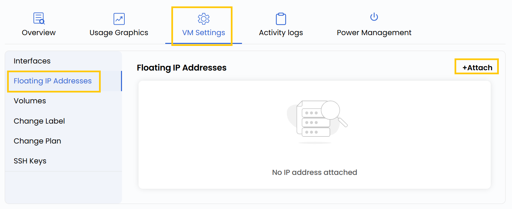
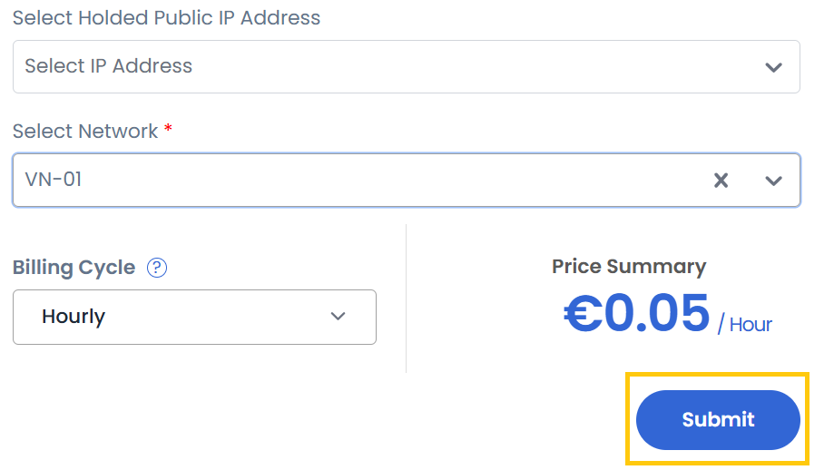

## Floating IP Address

A **Floating IP Address** enables external access to your virtual machine by associating a public IP with your internal instance. This allows your VM to be reachable from the internet while maintaining internal network isolation. Floating IPs are essential for scenarios such as web hosting, SSH access, and remote administration.

----------

- To add or change your public IP address configurations, go to the **VM settings** and navigate to the **Floating IP Addresses** section.
- Click on **Attach** to assign a public IP address from the network.

- Select a held public IP address and choose the associated network.

:::warning

Choose a held IP address if you want to use it, or leave it blank to get a new one

:::

- Choose the desired **Billing Cycle** for your IP. You can select either **Hourly** or **Monthly**. Click on **Submit** to apply the configuration.

----------

### Conclusion

Floating IPs provide dynamic access to virtual machines without affecting their internal configurations. By managing Floating IPs efficiently, you can balance accessibility and security based on your project’s requirements.

:::tip
**See also:**  
- **[Virtual Network](../../../Networks/Guides%20For%20OpenStack/Virtual%20Networks.md)**  
- **[Floating IP Address](../../../Networks/Guides%20For%20OpenStack/Floating%20IP%20Addresses.md)**  
:::

