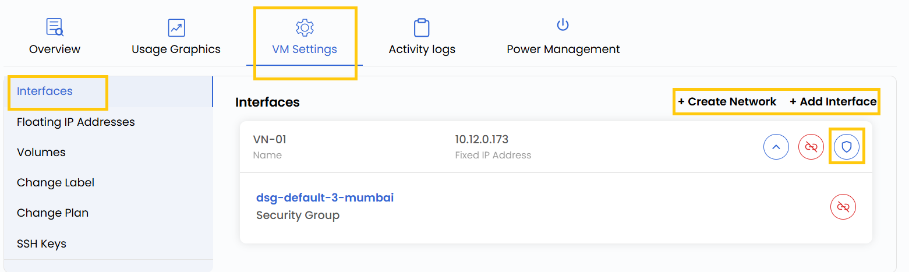

## Network Interfaces

The **Interfaces** section allows you to manage the VM’s network interfaces, providing control over both **private** and **public** connectivity. Private networks facilitate secure communication between virtual machines, while public networks allow access to the internet. You can also configure bandwidth limits, attach or detach IP addresses, and manage security groups for enhanced control.

----------

### Managing Network Interfaces

- Go to the **VM settings** and navigate to the **Interfaces** section.

- Click **Create Network** to create a new virtual network. For a more detailed explanation, refer to the **Networks** guide.

- To attach a network, click on **Attach Network** and select the appropriate network from the list. You can click on the attached network to modify its configurations.

- To add a security group, click the rightmost icon on the interface entry. Choose the desired **Security Group** from the list and click **Submit** to apply the changes.

----------

### Conclusion

Managing interfaces effectively helps you tailor the network behavior of your virtual machine to suit your architecture and security needs. Whether isolating environments via private networking or exposing services to the internet, the Interfaces section provides full flexibility.

:::tip
**See also:**  
- **[Virtual Network](../../../Networks/Guides%20For%20OpenStack/Virtual%20Networks.md)**  
- **[Virtual Router](../../../Networks/Guides%20For%20OpenStack/Virtual%20Routers.md)**  
- **[Security Group](../../../Networks/Guides%20For%20OpenStack/Security%20Groups.md)**
:::

