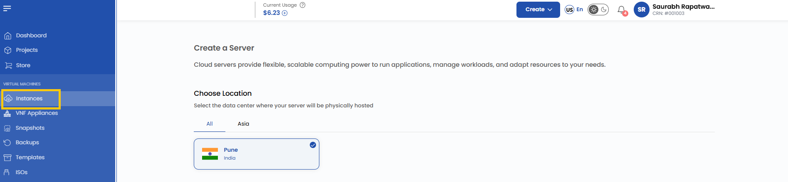
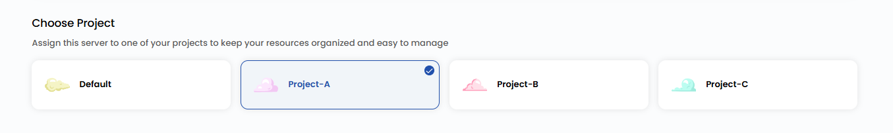
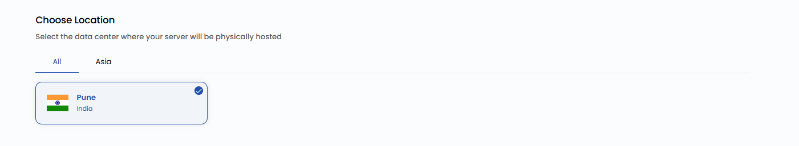
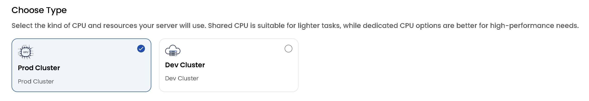
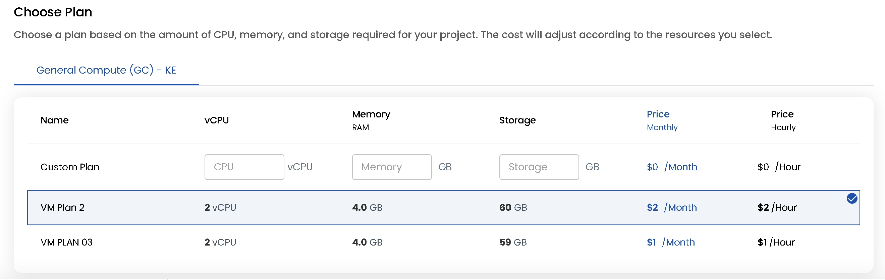
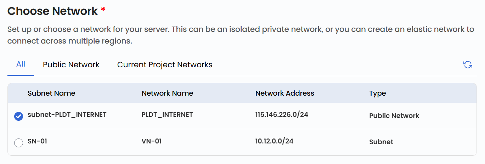
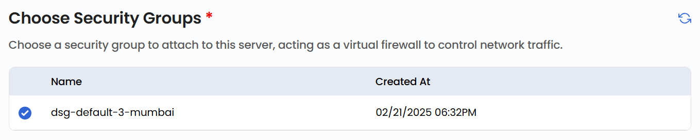
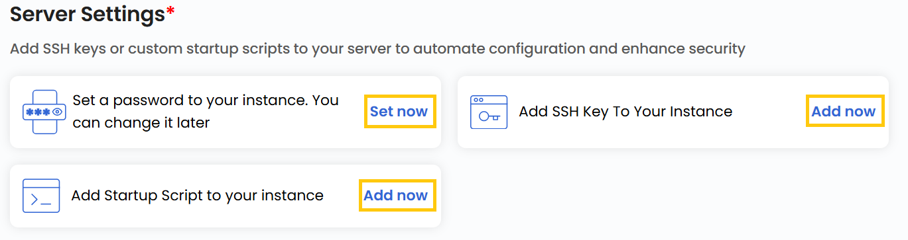
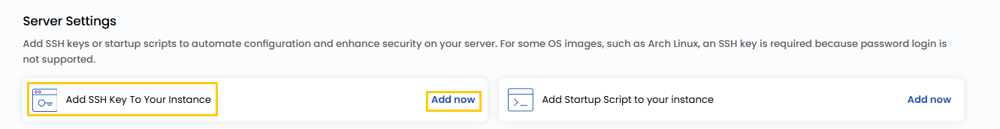
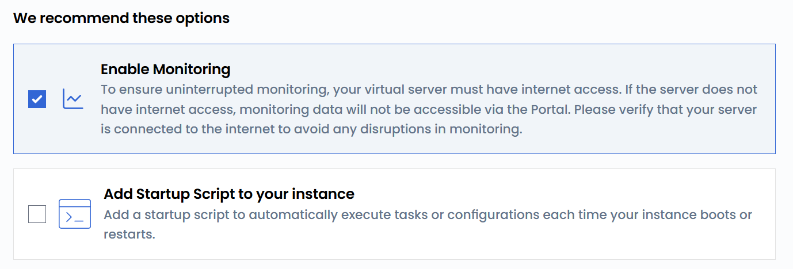

## Compute Instance

A **Compute Instance** is a virtual server in the cloud that functions similarly to a physical computer. It has its own CPU, memory, and storage, allowing you to install software, run applications, or host websites. With a Compute Instance, you have complete control over your server environment, making it flexible for various tasks. Compute Instances are a fundamental component of cloud services, enabling users to quickly launch and scale servers as needed.

----------

### Creating a Compute Instance on Stack Console

This guide provides step-by-step instructions for creating a cloud server instance, which offers flexible and scalable computing power for running applications, managing volumes, and adapting resources to your needs.

- From the left-hand menu, click on the **Instances** tab.
- You will be redirected to the **Instances** page.

- To create an instance, click the **plus (+)** icon located on the right side of the Instances page. This will open the Instance creation page.

### Assign to a Project

- Assign the server to one of your projects to organize and manage resources effectively.

### Choose a Location

- Select the data center location where your server will be physically hosted.
- Choose from the available locations listed.

### Choose an Image

- Select an operating system or application template to install on your server.
- Available options include popular OS images. Alternatively, you can import a custom ISO.
- **Note**: For Microsoft Windows, only official evaluation versions are available.

### Choose the Type of CPU Allocation

- Select the CPU resource allocation that fits your workload:

  - **Product Cluster**: High-performance, stable environment for running live, user-facing applications.
  - **Dev Cluster**: Low-cost, flexible environment for development, testing, and experimentation.

### Choose a Plan

- Choose a plan based on your requirements like CPU, memory, storage, and bandwidth. You can also create a custom plan if needed.

  - **General Compute (GC)**: Balanced workloads with a mix of CPU, memory, storage, and bandwidth. Ideal for general-purpose applications, web servers, and testing environments.

### Choose a Network

- Select the network for your instance based on your connectivity and security needs. To create network and for details about available network options, refer to the respective network guides.

 - **Public Network**: A simple, pre-configured network designed for external connectivity. Includes cloud firewall protection, port forwarding, and remote access VPN. Ideal for users who require straightforward, hassle-free connectivity.

### Choose Security Groups

- Choose a security group to attach to this server, acting as a virtual firewall to control network traffic.

### Configure Server Settings

- To configure password settings for your server:
    - In server settings, you can add password to your server to enhance security. Click on **Set now**.
    - Enter **Username** and **Password** then clcik on **Confirm** to add password. 
- Add a startup script to automate specific actions during instance initialization. Click on **Add Now** to add a startup script.

- Configure SSH settings for your server:
  - **Add SSH Key** for secure access. Click on **Add Now** to add an SSH key.
  - **Note**: For some OS images, such as Arch Linux, an SSH key is required because password login is not supported.

- Add the name of the SSH key with the key value and click **Add SSH Key**.

### Recommended Options

- **Enable Monitoring**: To ensure uninterrupted monitoring, your virtual server must have internet access. If the server does not have internet access, monitoring data will not be accessible via the Portal. Please verify that your server is connected to the internet to avoid any disruptions in monitoring.

- **Startup Script**: Add a startup script to automatically execute tasks or configurations each time your instance boots or restarts.

### Server Hostname

- Provide a unique **Server Name** and a valid **Server Hostname** for your instance to identify it easily in your dashboard.

### Review and Deploy

- Choose the desired **Billing Cycle** for your instance. Instance supports the following billing cycles: Hourly, Monthly, Quarterly, Semiannually, Yearly, Bi-annually, and Tri-annually. 

- It also supports a comprehensive set of billing rules, including Date to Date, Fixed Calendar Month, Unfixed Calendar Month, Fixed Prorata, and Unfixed Prorata.

- It supports multiple instance packages such as General Purpose, Compute-Optimized, and Memory-Optimized. These options allow users to choose configurations tailored to their workload performance and memory needs.

- Verify all the configuration details and review the price summary. Click on **Review & Deploy** to create the instance.

----------

### Conclusion

Creating a Compute Instance on Stack Console is a straightforward process that provides you with the flexibility and scalability needed to meet your computing requirements. By following this guide, you can configure your instance to suit your specific needs, whether for development, production, or specialized workloads. Regularly review and optimize your instance settings to ensure efficient resource utilization and enhanced performance. For further assistance, explore the Stack Console documentation or reach out to support.
