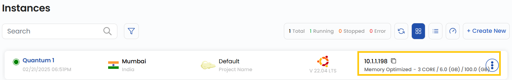
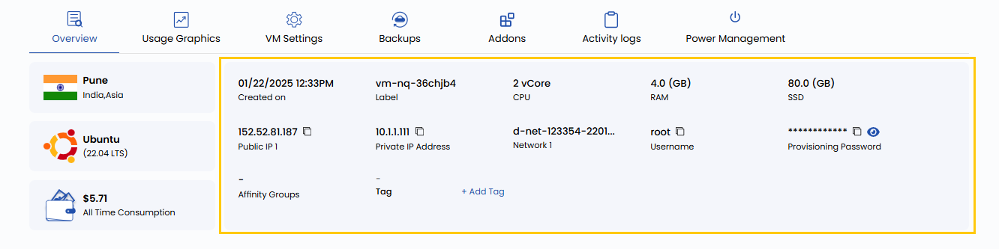

## <span style={{ color: '#003366' }}>Connect with SSH in Stack Console</span>  

You can manage your instance using a terminal and SSH. This allows you to connect securely and perform administrative tasks remotely. You can either use an SSH client or connect directly via your terminal. This guide provides step-by-step instructions to connect to your cloud instance using an SSH client or terminal for secure remote access.

---

### <span style={{ color: '#003366' }}>Connecting to Your Instance via SSH</span> 

Before connecting to your instance, ensure you have the following information:  

- **IP Address**: Available on the instance card or Virtual Machine Overview.  
- **Default Username**: Depending on the operating system (`root`, `ubuntu`, `ec2-user`).  
- **Authentication Method**:  
  - **SSH Key (recommended)** — Ensure you have access to your private key file.  
  - **Default Password** — Found in the Virtual Machine Overview if not using an SSH key. 

 

### <span style={{ color: '#003366' }}>Instance Information</span> 

- The **IP Address** of your instance is displayed on the card of your instance after you have created it. You can hover over it to copy it.

- More information about your instance can be found on the **Virtual Machine Overview**, which can be accessed by clicking on the name displayed on the Virtual Machine card.



### <span style={{ color: '#003366' }}>Connecting to Your Instance</span>  

- Open a terminal:  
  - **On Windows**: Use Command Prompt, PowerShell, or Git Bash.  
  - **On macOS or Linux**: Use the built-in terminal.  

- Use the appropriate SSH command to connect:  

  - **If you are using an SSH Key**:  
    ```bash
    ssh -i /path/to/your/private/key [username]@[ip_address]
    ```  
  - **If you are using a password**:  
    ```bash
    ssh [username]@[ip_address]
    ```  

- Enter your password if prompted. **With a password**:  
  ```bash
  ssh root@192.168.1.1


### <span style={{ color: '#003366' }}>Conclusion</span>
By following this guide, you can securely connect to your cloud instance using SSH. Whether you use an SSH key or a password, SSH provides a reliable and secure method for remote access and management. For further assistance, refer to the Stack Console documentation or reach out to support.

:::tip
**See also:**  
- **[Connect With RDP](./Connect%20With%20RDP.md)**  
- **[Console Access](./Console%20Access.md)**  
:::
