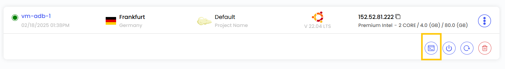
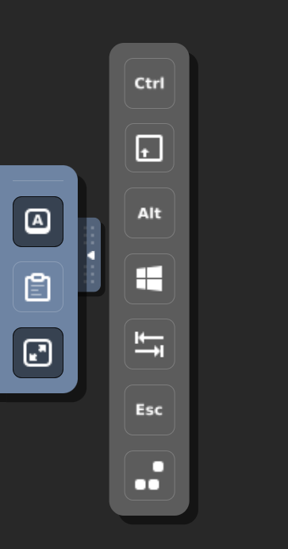
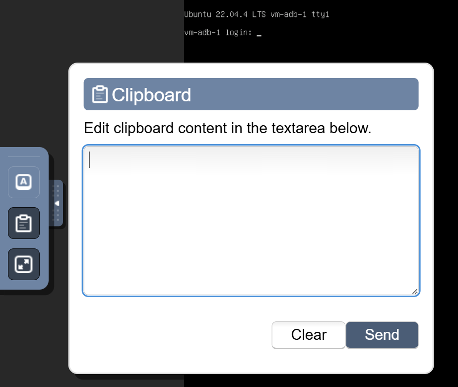

## Console Access for Virtual Machines

The **Console Access** feature enables users to manage and interact with their Virtual Machine (VM) through a web-based interface. This functionality is particularly beneficial for tasks such as troubleshooting startup issues, handling system configurations, and engaging with the VM's operating system as if physically present at the machine.

- Access your console by clicking on the console icon from the actions menu.

### Keyboard Shortcuts

The Console Access interface is equipped with various tools to optimize control over the VM, including specialized keyboard actions, clipboard management, and full-screen mode. Below are the shortcuts available in the interface:

- **Toggle Control (Ctrl):** Simulates pressing the Control key, enabling control-based commands within the VM.
- **Toggle Alt:** Simulates pressing the Alt key.
- **Toggle Shift:** Simulates pressing the Shift key.
- **Toggle Windows Key:** Simulates the Windows key, allowing users to open the start menu or execute system shortcuts in Windows operating systems.
- **Send Tab:** Sends a Tab key input to the VM, often used for navigating between form fields and interface elements.
- **Send Escape (Esc):** Sends an Escape key input.
- **Send Ctrl+Alt+Delete:** Sends the Ctrl+Alt+Delete combination.
- **Clipboard:** Facilitates seamless copying of text between the local machine and the VM, enabling efficient data transfer.

- **Full-Screen Mode:** Expands the VM console to full-screen mode, providing an immersive and uninterrupted user experience similar to working on a physical desktop.

### Managing Your VM

Console Access allows users to perform virtually any task requiring direct access to the machine, such as:

- Software installation.
- Configuration adjustments.
- Operating system troubleshooting.

This feature simplifies VM administration, making it especially valuable for system administrators who need to manage and maintain servers via the web interface without requiring external software like SSH or RDP.

### Conclusion

The **Console Access** feature provides a powerful and intuitive way to interact with your Virtual Machines directly through a web-based interface. Whether you're troubleshooting startup issues, configuring system settings, or performing administrative tasks, Console Access ensures seamless and efficient management of your VMs. For further assistance, refer to the Stack Console documentation or reach out to support.
