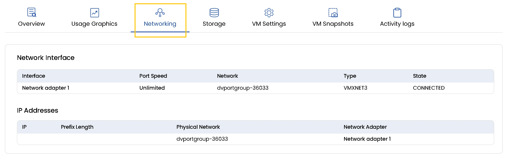

## Monitor Networks for VM in Stack Console

The **Networking** tab provides a comprehensive view of the network configuration and connectivity for a Virtual Machine Instance. It displays essential details such as network interfaces, connected networks, port speed, and assigned IP addresses helping you understand how your VM is connected within the infrastructure.

- To view networks for the instance, go to the **Networking** tab.
- You can track when a **Network Interface** was created, associated networks, port speed, and network type.
- You can also view the **IP Addresses** associated with the physical network and network adapter.

