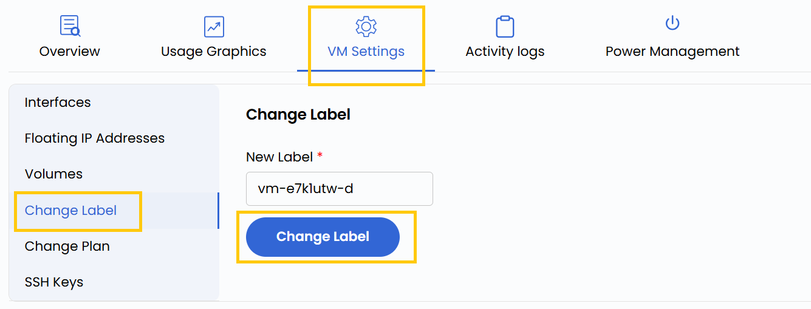

### **Change Label**

The label is the unique identifier for your virtual machine within the network. With this setting, you can modify the VM’s label to suit your organizational standards or project requirements. Changing the label can help with better identification, or alignment with specific naming conventions.

- To change hostname go to the **VM settings** and navigate to the **Change Label** section. 
- Enter new hostname and click on **Change Label**.

