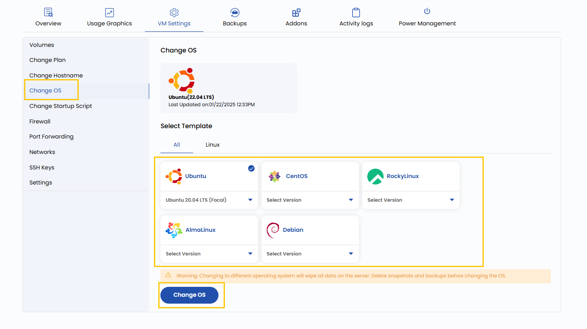

### **Change OS**

This setting allows you to reinstall or switch the operating system (OS) running on your virtual machine. You can choose from various OS options, such as Linux distributions (Ubuntu, CentO    S, Debian, etc.) or Windows Server versions. Note that changing the OS will erase all existing data and configurations on the VM, so ensure to back up critical data beforehand.

- To change operating system go to the **VM settings** and navigate to the **Change OS** section. 
- From **Templates** select the OS and the particuler version and then click on **Change OS**.

:::tip
**See also:**  
- **[Templates](../../../Templates/Create%20Templates.md)**  
- **[ISOs](../../../ISOs/Import%20ISO.md)**  
:::