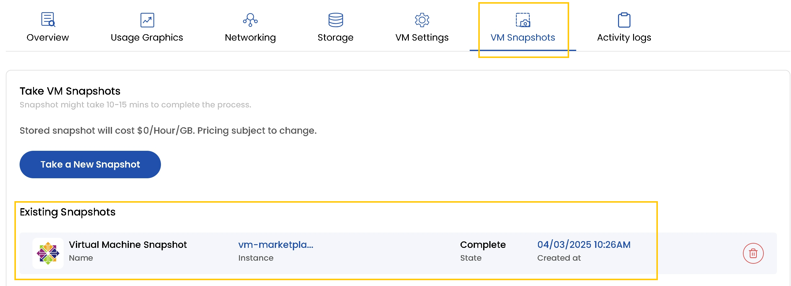

## Snapshots for VM in Stack Console

The **VM Snapshots** capture the current state of a volume or instance at a specific point in time, ensuring data integrity and providing a reliable solution for backup and recovery. These snapshots allow you to quickly restore your volume to its exact state at the time of creation, helping to recover from accidental deletion, corruption, or system failures.

- To view snapshots for the instance, go to the **VM Snapshots** tab.
- If you want to see presently created snapshots for the volume, navigate to **Existing Snapshot** section to view all snapshots.
- To create a new snapshot, simply click on **Take a New Snapshot**. This will capture the current state of the volume, allowing you to restore it if needed. 

 

:::tip
**See also:**  
- **[Volume Snapshot](./../../Volume%20Snapshot/Create%20Volume%20Snapshot.md)**  
- **[VM Snapshot](./../../VM%20Snapshots/Create%20Instance%20Snapshot.md)**
:::