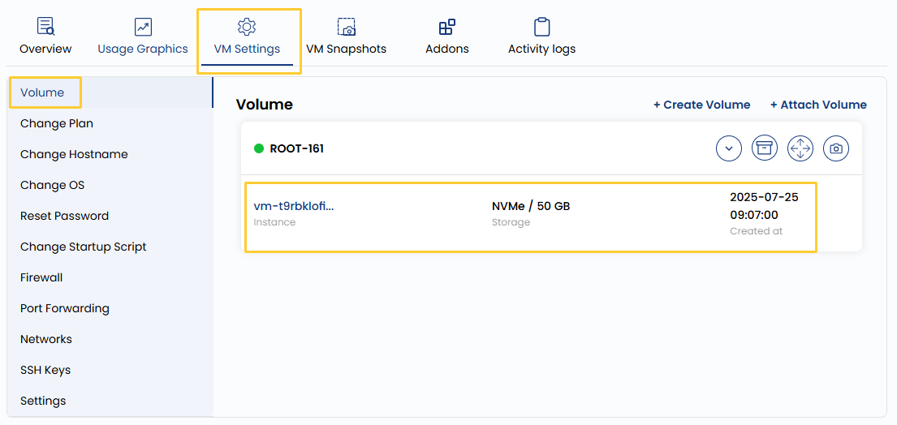

## Block Storage

Block Storage allows you to attach additional storage volumes to your virtual machine. These volumes act as independent, scalable disks that can be used for storing application data, backups, or other files. They are highly flexible and can be detached or re-attached to different instances without data loss. This is ideal for separating your operating system from application data to maintain modularity.

----------

- To view a volume instance, go to the **VM settings** and navigate to the **Volume** section, where you can view the instance volume and its size. 
- If you want to see previously created snapshots for the volume, click the right arrow icon to expand the list. 
- To create a new snapshot, simply click the camera icon on the rightmost side. This will capture the current state of the volume, allowing you to restore it if needed.

----------

### Conclusion

Block Storage provides a reliable and modular way to manage your data independently of your virtual machines. With the ability to create snapshots, scale volumes, and attach them across different instances, it ensures both flexibility and data protection. Use snapshots regularly to safeguard critical data, and manage storage efficiently through the VM settings panel.

:::tip
**See also:**  
- **[Create Volume](../../../Volume/Create%20Block%20Storage.md)**  
- **[Volume Snapshot](../../../Volume%20Snapshot/Create%20Volume%20Snapshot.md)**  
- **[VM Snapshot](../../../VM%20Snapshots/Create%20Instance%20Snapshot.md)**
:::
