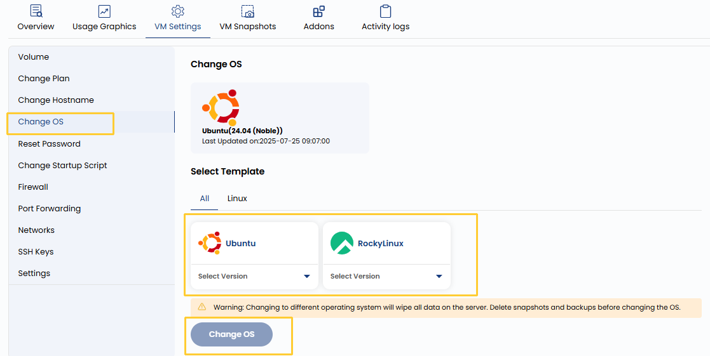

## Change Operating System

This setting allows you to reinstall or switch the operating system (OS) running on your virtual machine. You can choose from various OS options, such as Linux distributions (Ubuntu, CentOS, Debian, etc.) or Windows Server versions. Note that changing the OS will erase all existing data and configurations on the VM, so ensure to back up critical data beforehand.

----------

- To change operating system go to the **VM settings** and navigate to the **Change OS** section.  
- From **Templates** select the OS and the particular version and then click on **Change OS**.

:::warning

Changing to different operating system will wipe all data on the server. Delete snapshots and backups before changing the OS.

:::

----------

### Conclusion

Changing the OS of a virtual machine allows you to adapt to different software requirements or start fresh with a clean environment. Always ensure proper backups are taken before proceeding, as this operation removes existing configurations and data. Select a reliable and compatible OS template to match your workload needs.

:::tip
**See also:**  
- **[Create Template](../../Templates//Create%20Templates.md)**  
<!-- - **[Import ISO](../../../ISOs/Import%20ISO.md)** -->
:::
