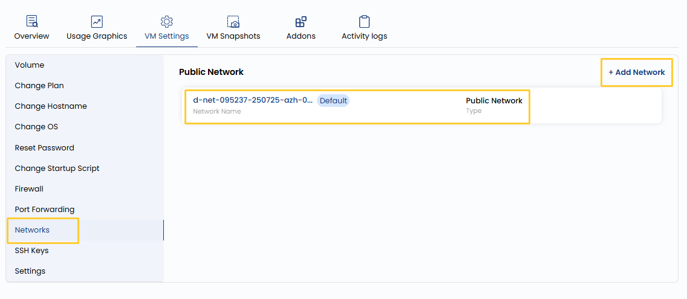

## Network Configuration

This setting allows you to manage the VM’s network interfaces, including configuring private and public network options. Private networks are used for communication between your virtual machines without exposing them to the internet, while public networks provide external IP addresses for internet access. You can also adjust bandwidth limits and assign or remove IP addresses.

----------

- To add or change your network configurations, go to the **VM settings** and navigate to the **Networks** section.  
- Click on **Add Network** to add network and click on the network to change the configurations for that network.

----------

### Conclusion

Managing network configurations is essential for ensuring both connectivity and security of your virtual machines. Whether you're setting up internal communication through private networks or exposing services via public networks, the flexibility to assign and configure interfaces helps tailor your infrastructure to specific use cases. Always review your bandwidth and access settings to avoid conflicts and ensure optimal performance.

:::tip
- **[Create VPC Networks](../../Networks//VPC%20Network//Create%20VPC%20Network.md)**  
- **[Create Public Networks](../../Networks//Public%20Network//Create%20Public%20Network.md)**
:::
