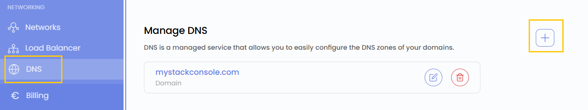
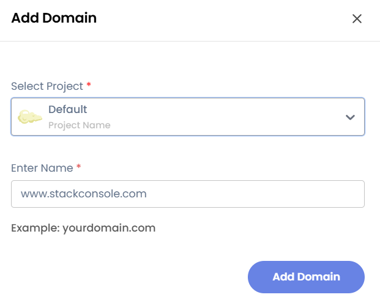

## Domain Name System (DNS)

The **Domain Name System (DNS)** is a critical component of the internet that translates human-readable domain names (e.g., google.com) into machine-readable IP addresses (e.g., 142.250.190.14). This system ensures that users can access websites and online services without memorizing numerical IP addresses.

----

### Creating a Domain Name System

- From the left-hand side menu, click on the **DNS** tab.
- You will be redirected to the **DNS** page. To add a domain, click on the **plus (+)** icon located on the right side of the page.

### Add Domain

- From the form, choose the **Project** and enter the name of your domain.
- Click on **Add Domain**, and your domain will be created successfully.

### Conclusion

By following this guide, you can easily add and manage domains using the **DNS** feature in Stack Console. DNS simplifies the process of accessing websites and online services by translating domain names into IP addresses. For further assistance, refer to the Stack Console documentation or reach out to support.
