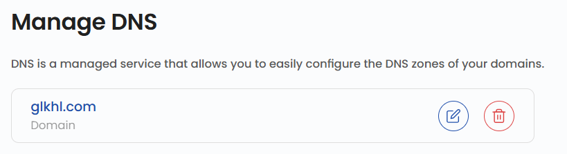
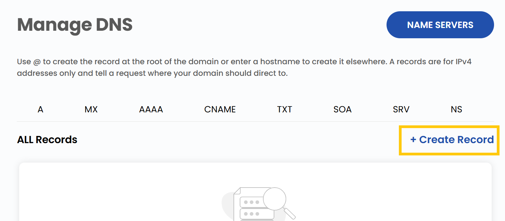
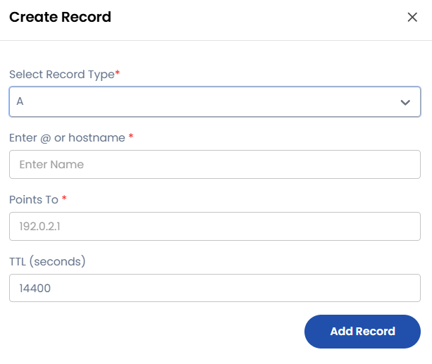

## <span style={{ color: '#003366' }}>Managing DNS</span>

DNS (Domain Name System) records are essential components of the internet, enabling domain names to connect with specific services like websites, emails, and security protocols. Each DNS record type has a unique role in managing domain functionality. Below is a detailed explanation of each record type with both paragraph descriptions and detailed entry fields.

---

Once your DNS is active, use the dashboard to monitor storage performance, name servers, create and manage records.



- Use @ to create the record at the root of the domain or enter a hostname to create it elsewhere. A records are for IPv4 addresses only and tell a request where your domain should direct to.
- To create a new record, click on the **Create Record**.



- To create the record you need to fill up details associated with the particular records which are available. 



### <span style={{ color: '#003366' }}>A Record (Address Record)</span>

The **A Record** maps a domain name to an IPv4 address. This record ensures that when users enter a domain like `example.com`, they are directed to the appropriate web server's IP address.  

**Key Points:**
- **Purpose:** Maps domain names to IPv4 addresses.
- **Enter `@` or hostname:** Use `@` for root domain or enter a hostname for subdomains.
- **Points To:** `192.0.2.1`
- **TTL (seconds):** `14400`

**Example Entry:**  
```
@    A    192.0.2.1    14400
```
### <span style={{ color: '#003366' }}>AAAA Record (IPv6 Address Record)</span>

The **AAAA Record** maps domain names to IPv6 addresses, offering enhanced connectivity and security. 

**Key Points:**
- **Purpose:** Maps domain names to IPv6 addresses.
- **Enter `@` or hostname:** Use `@` for root domain or enter a hostname for subdomains.
- **Points To:** `2001:0db8:85a3:0000:0000:8a2e:0370:7334`
- **TTL (seconds):** `14400`

**Example Entry:**  
```
@    AAAA    2001:0db8:85a3:0000:0000:8a2e:0370:7334    14400
```
### <span style={{ color: '#003366' }}>CNAME Record (Canonical Name Record)</span>

The **CNAME Record** creates an alias for a domain name, redirecting requests from one domain to another. 

**Key Points:**
- **Purpose:** Aliases one domain to another.
- **Enter `@` or hostname:** Use `@` for root domain or enter a hostname for subdomains.
- **Target:** `example.com.`
- **TTL (seconds):** `14400`

**Example Entry:**  
```
blog    CNAME    example.com.    14400
```
### <span style={{ color: '#003366' }}>MX Record (Mail Exchange Record)</span>

The **MX Record** directs email messages to the appropriate mail server for a domain. 

**Key Points:**
- **Purpose:** Directs email to a designated mail server.
- **Enter `@` or hostname:** Use `@` for root domain or enter a hostname for subdomains.
- **Priority:** `10`
- **Mail Server:** `mail.example.com.`
- **TTL (seconds):** `14400`

**Example Entry:**  
```
@    MX    10 mail.example.com.    14400
```
### <span style={{ color: '#003366' }}>TXT Record (Text Record)</span>

The **TXT Record** stores arbitrary text data and is widely used for domain verification, email security, and other custom instructions.

**Key Points:**
- **Purpose:** Holds textual information for verification or security.
- **Enter `@` or hostname:** Use `@` for root domain or enter a hostname for subdomains.
- **TXT Value:** `v=spf1 mx -all`
- **TTL (seconds):** `14400`

**Example SPF Entry:**  
```
@    TXT    "v=spf1 mx -all"    14400
```
### <span style={{ color: '#003366' }}>NS Record (Name Server Record)</span>

The **NS Record** identifies the authoritative DNS servers for a domain. 

**Key Points:**
- **Purpose:** Designates the authoritative name servers for a domain.
- **Enter `@` or hostname:** Use `@` for root domain or enter a hostname for subdomains.
- **Nameserver:** `ns1.example.com.`
- **TTL (seconds):** `14400`

**Example Entry:**  
```
@    NS    ns1.example.com.    14400
```
### <span style={{ color: '#003366' }}>SRV Record (Service Record)</span>

The **SRV Record** specifies details for locating specific services within a domain. 

**Key Points:**
- **Purpose:** Identifies servers hosting particular services.
- **Enter `@` or hostname:** Use `@` for root domain or enter a hostname for subdomains.
- **Priority:** `10`
- **Weight:** `60`
- **Port:** `5060`
- **Target:** `sipserver.example.com.`
- **TTL (seconds):** `14400`

**Example SIP Entry:**  
```
_sip._tcp    SRV    10 60 5060 sipserver.example.com.    14400
```
### <span style={{ color: '#003366' }}>SOA Record (Start of Authority Record)</span>

The **SOA Record** defines key administrative details about the DNS zone.

**Key Points:**
- **Purpose:** Provides essential information for DNS zone management.
- **TTL (seconds):** `86400`

**Example Entry:**  
```
@    SOA    ns1.example.com admin.example.com 2024031001 7200 3600 1209600 86400
```
----

### <span style={{ color: '#003366' }}>Conclusion</span>

By understanding and managing these DNS record types, you can effectively configure and optimize your domain's functionality. Whether you're directing traffic, securing emails, or managing services, DNS records are essential for maintaining a robust online presence. For further assistance, refer to the Stack Console documentation or reach out to support.
