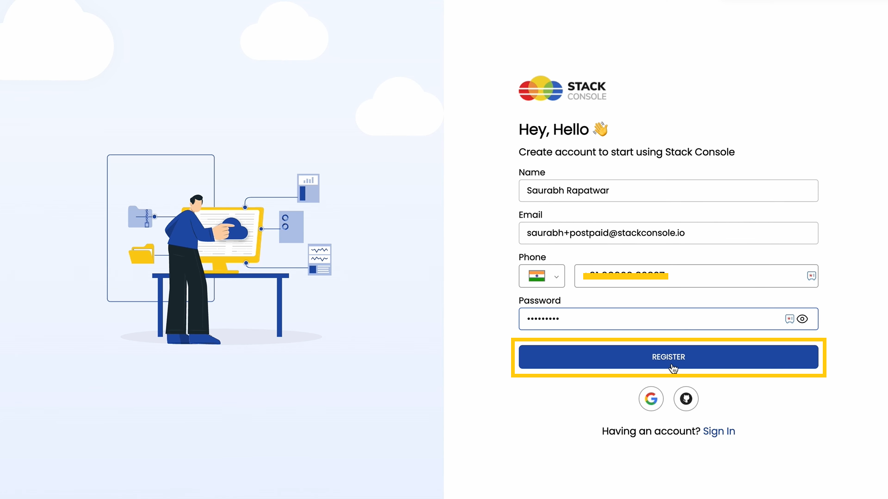
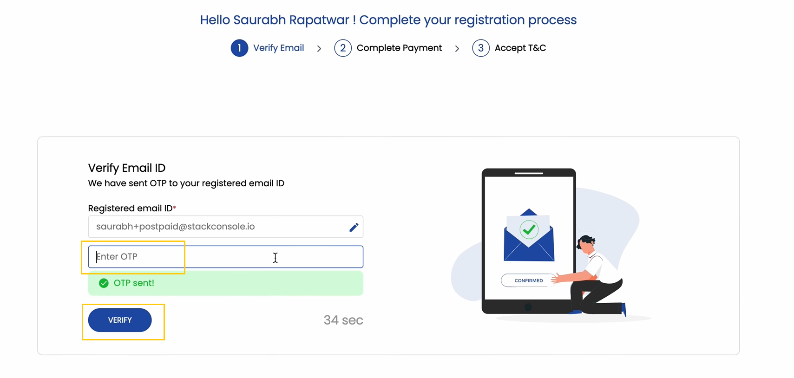
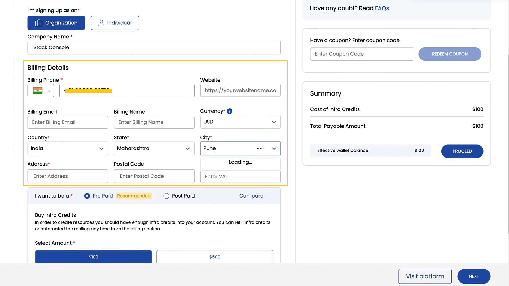
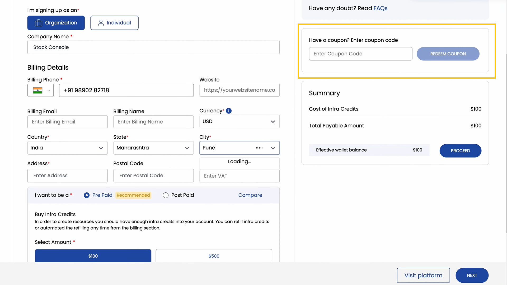
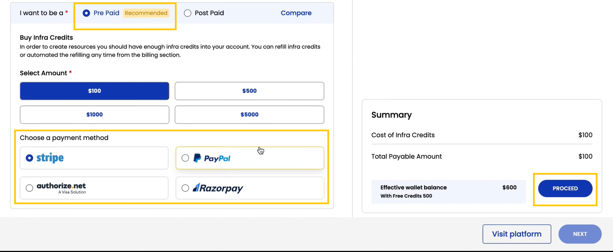
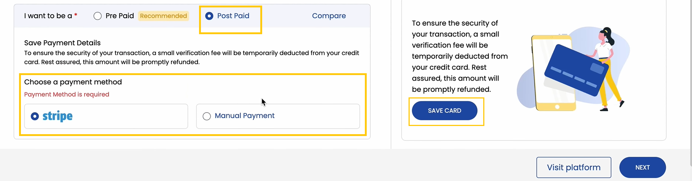
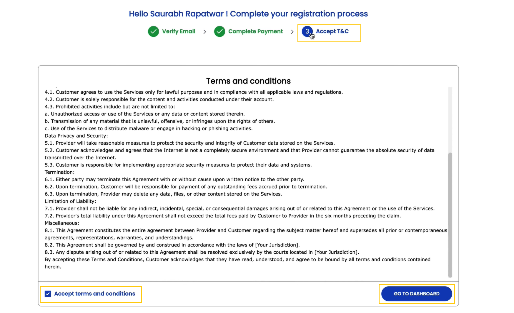
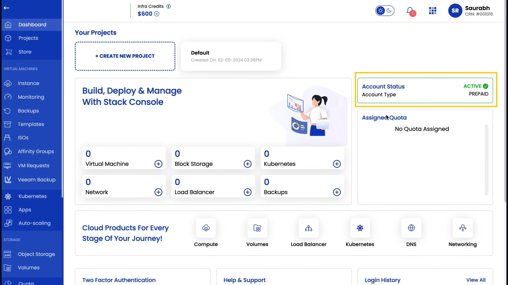
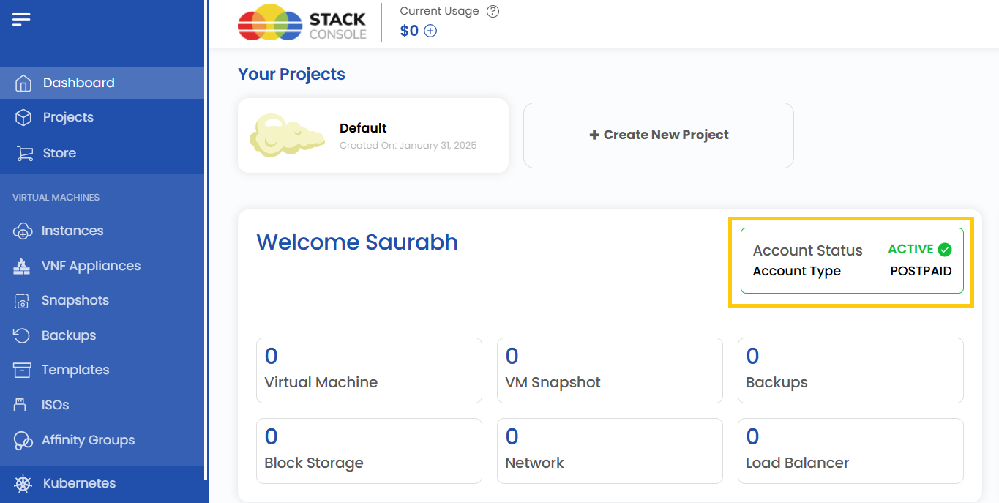

### **StackConsole Account Setup Guide**

This guide is a step-by-step tutorial designed to walk you through the process of creating a StackConsole account, setting up billing, and verifying your account.

### Register Account
- Visit the StackConsole website and navigate to the **Sign-In** or **Create Account** section.
- Enter the necessary details such as your name, email address, and password to create your account.
- Click on **Register**, you will be redirected to the next step.

 

### Verify Your Email

- Check your email inbox for a verification email from StackConsole. This email contains a One-Time Password (OTP).
- Enter the **OTP** in the field provided on the website to verify your email address.
- Click **Verify** to confirm and proceed to the billing setup.

 

### Set Up Billing Method

- Once your account is verified, you’ll be prompted to set up your billing information.
- Choose Billing Type:

    - **Individual**: For personal usage, enter details like your address.
    - **Company**: For organizational use, provide details such as your company name, website, and address.

- If you have a coupon, you can redeem it while checking out to receive a discount or promotional offer.

### Choose payment plan

#### Prepaid (Recommended):

- Prepaid accounts require you to load credits in advance. You’ll use these credits to create resources within the platform. This is the default and most straightforward option, ensuring you don’t overspend.
- In order to, use resources you need to buy infra credits. You can select the amount given to buy the credits.
- Choose a payment method (e.g., Stripe, PayPal, Razorpay). Click on **Proceed** to complete the payment.

#### Postpaid:

- Postpaid accounts allow you to pay after consuming resources. This method may require additional verification, such as more detailed billing information or credit checks.
- Choose a payment method (e.g., Stripe, PayPal, Razorpay, Manual). Click on **Save Card** to complete the payment.

- After payment, carefully review the **Terms & Conditions** of the platform.
- Accept the terms to complete the registration process.

- Once registration is complete, you can access your **StackConsole Dashboard** to start using the platform.

- **Prepaid Users**: Your account status will display as active, with the account type set to prepaid.

- **Postpaid Users**: Once verification is complete, your account will display as active with the account type set to postpaid.

