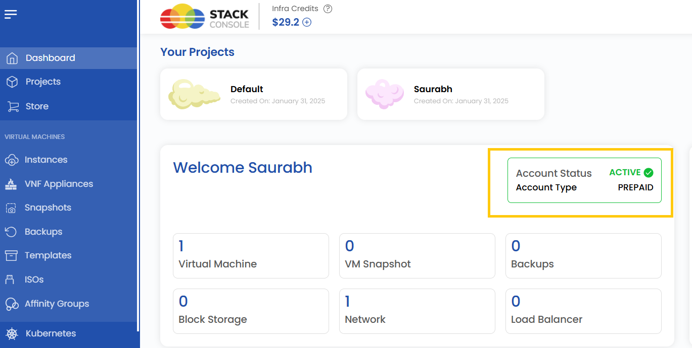

## Stack Console Account Setup Guide

This guide provides a step-by-step tutorial to help you create a Stack Console account, set up billing, and verify your account.

### Register Account {#Register-Account}

- Visit the Stack Console website and navigate to the **Sign-In** or **Create Account** section.
- Enter the necessary details, such as your name, email address, and password.
- Click **Register** to proceed to the next step.

 

### Verify Your Email {#Verify-Your-Email}

- Check your email inbox for a verification email from Stack Console containing a One-Time Password (OTP).
- Enter the **OTP** in the provided field on the website.
- Click **Verify** to confirm and proceed to the billing setup.

 

### Set Up Billing Method {#Set-Up-Billing-Method}

- After verifying your account, you’ll be prompted to set up your billing information.
- Choose a billing type:
    - **Individual**: For personal use; enter details like your address.
    - **Company**: For organizational use; provide details such as your company name, website, and address.

- If you have a coupon, redeem it at checkout to receive a discount or promotional offer.

### Choose a Payment Plan

#### Prepaid (Recommended):

- Prepaid accounts require you to load credits in advance, which you’ll use to create resources within the platform.
- To use resources, purchase infrastructure credits by selecting the desired amount.
- Choose a payment method (e.g., Stripe, PayPal, Razorpay) and click **Proceed** to complete the payment.

#### Postpaid:

- Postpaid accounts allow you to pay after consuming resources. This option may require additional verification, such as detailed billing information or credit checks.
- Choose a payment method (e.g., Stripe, PayPal, Razorpay, Manual) and click **Save Card** to complete the payment.

### Final Steps

- Review the **Terms & Conditions** of the platform carefully.
- Accept the terms to complete the registration process.

- **Prepaid Users**: Your account status will display as active, with the account type set to prepaid.

- **Postpaid Users**: After verification, your account will display as active with the account type set to postpaid.

### Conclusion

Setting up your Stack Console account is a straightforward process. By following the steps outlined in this guide, you can successfully register, verify your email, configure billing, and choose a payment plan that best suits your needs. Once completed, you’ll have full access to the Stack Console dashboard and its features, enabling you to manage your resources efficiently.
