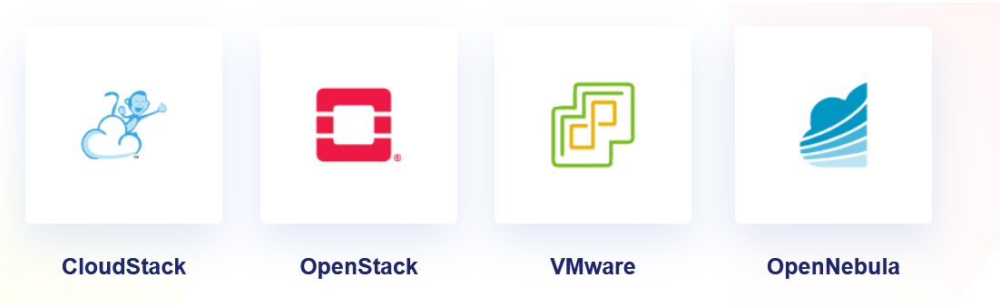

import React from 'react';
import Link from '@docusaurus/Link';

  <h1>👋 Welcome to Stack Console Documentation!</h1>
  
Manage and optimize your cloud infrastructure with Stack Console.

## 📖 About Stack Console

**Stack Console** is an advanced, cloud unified  management platform designed to integrate with multiple cloud infrastructures. It provides a single unified interface for provisioning, monitoring, and managing resources across different cloud environments. 

With Stack Console, organizations can simplify the complexity of multi-cloud operations, increase operational efficiency, and gain real-time insights into their cloud infrastructure. 

## Features of Stack Console  

  
  

    
☁️

    <h4>Multi-cloud Management</h4>
    
Manage resources across multiple cloud platforms seamlessly.

  

  

    
📊

    <h4>Real-time Monitoring</h4>
    
Track and analyze cloud usage with real-time alerts.

  

  
  

    
⚡

    <h4>Automated  Scaling</h4>
    
Automatically scale cloud resources based on demand.

  

  
  

    
💰

    <h4>Cost  Optimization</h4>
    
Optimize cloud expenses with cost analysis tools.

  

  
  

    
🔒

    <h4>Advanced  Security</h4>
    
Ensure cloud security with authentication and audit logs.

  

  

 

**Stack Console** is more than just a management platform—it's a powerful tool that connects you to your entire cloud infrastructure across various providers. By centralizing operations, it empowers cloud administrators to manage resources more efficiently, monitor critical infrastructure in real-time, and take proactive steps toward improving the scalability and cost-efficiency of their cloud environments. Key Integrations of Stack Console include popular cloud platforms such as **OpenNebula** , **Apache CloudStack**, **OpenStack** and **VMware**.

 

### Account Setup

  

    <Link to="./Account Signup#Register-Account" style={{ textDecoration: 'none', color: '#000', display: 'block' }}>
      <h3 style={{ color: '#0073e6' }}>Register Account</h3>
      
Sign up with your personal details to get started.

    </Link>
  

  

    <Link to="./Account Signup#Verify-Your-Email" style={{ textDecoration: 'none', color: '#000', display: 'block' }}>
      <h3 style={{ color: '#0073e6' }}>Verify Your Email</h3>
      
Confirm your email address for security.

    </Link>
  

  

    <Link to="./Account Signup#Set-Up-Billing-Method" style={{ textDecoration: 'none', color: '#000', display: 'block' }}>
      <h3 style={{ color: '#0073e6' }}>Set Up Billing</h3>
      
Choose a payment option and set up your billing details.

    </Link>
  

---

### Profile Setup

  

    <Link to="./Profile Setup#profile" style={{ textDecoration: 'none', color: '#000', display: 'block' }}>
      <h3 style={{ color: '#0073e6' }}>Setup Your Profile</h3>  
      
Manage your name, contact details, and address.

    </Link>
  

  

    <Link to="./Profile Setup#enable-2fa" style={{ textDecoration: 'none', color: '#000', display: 'block' }}>
      <h3 style={{ color: '#0073e6' }}>Set Up Two-Factor Authentication</h3>
      
Secure your profile and user profile with 2FA.

    </Link>
  

  

    <Link to="./Profile Setup#new-user" style={{ textDecoration: 'none', color: '#000', display: 'block' }}>
      <h3 style={{ color: '#0073e6' }}>Add New User</h3>   
      
Add new Users to your account and assign roles with permissions.

    </Link>
  

---

### 🚀 Next Steps

To start your journey with **Stack Console**, head over to the guides above and begin by creating your account, setting up your profile, and configuring your billing. The setup is straightforward, and with Stack Console's powerful integrations, you’ll be up and running in no time!

