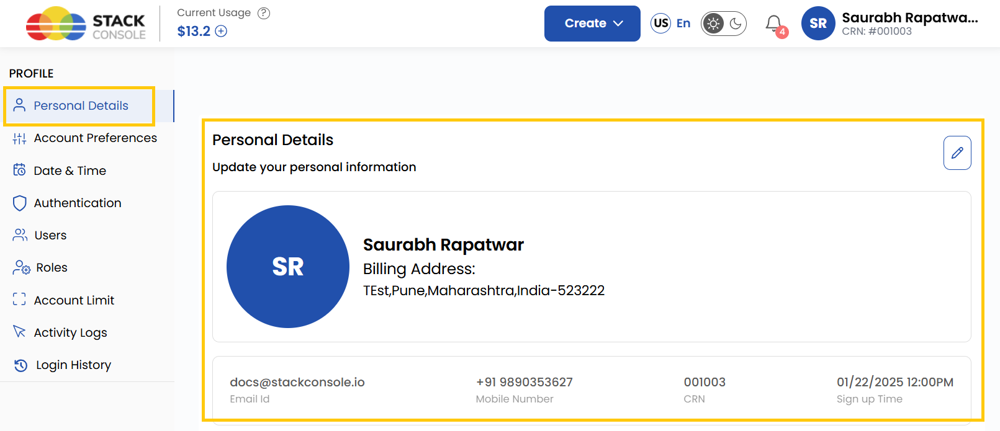
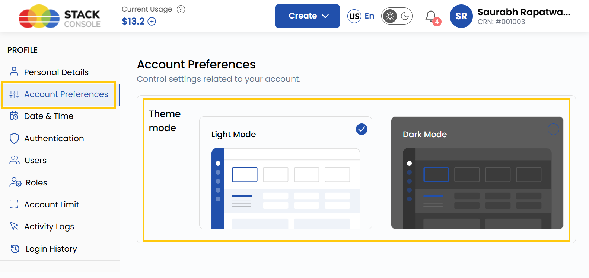

## Setup User Profile in Stack Console

The **Stack Console** user profile setup feature allows users to manage their personal information, change passwords, configure payment settings, add users, roles and monitor account activity. This feature provides users with a detailed overview of their account and allows for customization and control.

  

### Update Your Personal Information

Keep your personal details up-to-date to ensure that your profile reflects accurate information. This section allows you to update essential fields such as name, contact number, and address.

- Navigate to the **Profile** section from the left-hand menu.
- Select **Personal Details** to update your personal information.
- Click on **Submit** to save changes.

    

### Manage Billing Information

Accurate billing information is essential for managing subscriptions and payments. This section allows you to add or update your billing address and phone number for invoicing purposes.

- Navigate to the **Profile** section from the left-hand menu.
- Select **Personal Details** and go to **Billing Details**.

- Add or update the **Billing Address**.
- Add a **Phone Number** for billing purposes.
- Once done, click on **Submit** to save changes.

### Customize Account Preferences

Choose how you interact with dashboard by customizing your account preferences. This section allows you to switch between different visual modes to match your desired experience.

- Navigate to the **Profile** section from the left-hand menu.
- Select **Account Preferences** to access customization options.

- You can choose between **Light Mode** and **Dark Mode**.
- Toggle your preferred mode, and the changes will be applied instantly.

### Change Date and Time Settings

Ensure the date and time format aligns with your preference, especially if you're working across different regions or need a specific display format for events. You can configure your date and time settings for your account as per your preferences.

- Navigate to the **Profile** section from the left-hand menu.
- Select **Date and Time Settings** to configure your preferences.

- Under **Preferred Time Zone**, choose your preferred time zone from the dropdown menu.
- Under **Preferred Date Time Format**, select your preferred format for displaying date and time.
- Click on **Submit** to apply the changes.

### Secure Your Account with Two-Factor Authentication

To enhance the security of your account you can enable **Two-Factor Authentication (2FA)**, which adds an additional layer of protection to your login process.

- Navigate to the **Profile** section from the left-hand menu.
- Select **Authentication** to access account security options and locate the **Two-Factor Authentication (2FA)** section.
- Under **Email Authentication**, click the **Set Up** button to enable two-factor authentication for your account.

- Enter your **Email ID** and click on **Send OTP**. 

- Enter the OTP sent to your email.
- You have successfully enabled **Two-Factor Authentication (2FA)** on your account.
- To enforce two-factor authentication for every sub-user in the organization, toggle the **Enable 2FA for All Users** .

### Change Your Password

To maintain account security, it's essential to change your password periodically. This section lets you update your current password.

- Navigate to the **Profile** section from the left-hand menu.
- Select **Authentication**, then click on **Change Password**.

- Enter your **Current Password**, then enter your **New Password** and confirm it.
- Click the **Change Password** button to save changes.
- Your **New Password** has been updated successfully.

### Add a New User

The **Users** section allows you to add new users to your organization and assign specific roles and permissions.

- Navigate to the **Profile** section from the left-hand menu.
- Select **Users** to add a new user and click on **Add User**.

- Enter the user details. 

- If you enable the **Ask user to set password on first login**, the user will be able to set a password at their first login.

- Select the **Role** from the menu. Some available roles include:

    - **Owner**: Full access to all features, including account settings, billing, and resource management. Can add, remove, and modify user roles and permissions.

    - **Service Administrator**: Manages and configures services, such as virtual machines, storage, and networks, but cannot manage user roles or account settings.

    - **Service Viewer**: View-only access to services and resources. Cannot make any changes but can monitor and review data and configurations.

- Select the project and click on **Submit**.
- The user has been successfully created.

### Assign User Roles and Permissions

The **Roles** section allows you to assign and manage specific roles and permissions for each user within your organization.

- Navigate to the **Profile** section from the left-hand menu.
- Select **Roles** to add a new role for a user. You can view **Roles** which are already present.

- You can view permissions for each role in the **Permissions** section.

Here are the available permissions for each role:

| **Permission**                    | **Description**                                   |
|------------------------------------|--------------------------------------------------|
| Project Manage                     | Can create, update, or destroy a project         |
| Project Read                       | Can view projects                                |
| Virtual Machine Manage             | Can create, update, or destroy a virtual machine |
| Virtual Machine Read               | Can view virtual machine                         |
| Virtual Machine Snapshot Manage    | Can create, update, or destroy a snapshot        |
| Virtual Machine Snapshot Read      | Can view virtual machine snapshots               |
| Virtual Machine Backups Manage     | Can create, update, or destroy backups           |
| Virtual Machine Backups Read       | Can view virtual machine backups                 |
| VPC Manage                         | Can create, update, or destroy a VPC             |
| VPC Read                           | Can view VPC                                     |
| Network Manage                     | Can create, update, or destroy a network         |
| Network Read                       | Can view networks                                |
| Load Balancer Manage               | Can create, update, or destroy a load balancer   |
| Load Balancer Read                 | Can view load balancers                          |
| Block Storage Manage               | Can create, update, or destroy block storage     |
| Block Storage Read                 | Can view block storages                          |
| Block Storage Snapshot Manage      | Can create, update, or destroy block storage snapshots |
| Block Storage Snapshot Read        | Can view block storage snapshots                 |
| Virtual Router Manage              | Can create, update, or destroy a virtual router  |
| Virtual Router Read                | Can view virtual router                          |
| IP Address Manage                  | Can manage IP addresses                          |
| IP Address Read                    | Can view IP addresses                            |
| ISO Manage                         | Can manage ISOs                                  |
| ISO Read                           | Can view ISOs                                    |
| Kubernetes Manage                  | Can manage Kubernetes                            |
| Kubernetes Read                    | Can view Kubernetes                              |
| Templates Manage                   | Can manage templates                             |
| Templates Read                     | Can view templates                               |
| Marketplace App Read               | Can view marketplace apps                        |
| VM Autoscale Manage                | Can manage VM autoscaling                        |
| VM Autoscale Read                  | Can view VM autoscaling                          |
| Support Ticket Manage              | Can manage tickets                               |
| Support Ticket Read                | Can read tickets                                 |
| Support Ticket Reply Manage        | Can send replies to tickets, view tickets        |
| Support Ticket Reply Read          | Can view ticket replies                          |
| Store Manage                       | Can manage store                                 |
| Store Read                         | Can view store                                   |
| Monitoring Read                    | Can view monitoring                              |
| DNS Manage                         | Can manage DNS and DNS records                   |
| DNS Read                           | Can view DNS                                     |
| Affinity Groups Manage             | Can manage affinity groups                       |
| Affinity Groups Read               | Can view affinity groups                         |
| Security Group Manage              | Can create, update, or destroy security groups   |
| Security Group Read                | Can view security groups                         |
| Object Storage Manage              | Can manage object storage                        |
| Object Storage Read                | Can view object storage                          |
| Billing Manage                     | Can manage billing                               |
| Billing Read                       | Can view billing                                 |
| Quota Manage                       | Can manage quotas                                |
| Quota Read                         | Can view quotas                                  |
| Profile Manage                     | Can create, update, or destroy a profile         |
| Profile Read                       | Can view profile                                 |

- To add a new role and permissions, click the plus (+) icon in the top right corner to **Add New Role**.
- Add the **Role Name** and select permissions associated with the corresponding features. 
- Click on **Create Role**. The role has been successfully created.

### Set Account Limits

The **Account Limits** feature allows users to view their current resource usage and limits, as well as request increases for resources as required. This ensures efficient resource allocation and scalability for expanding workloads.

- Navigate to the **Profile** section from the left-hand menu.
- Select **Account Limit** to view the account limit table.

The account limit table provides the following details for each action:

| **Column**     | **Description**                                                          |
|----------------|--------------------------------------------------------------------------|
| **Resource**   | The type of resource being monitored (e.g., CPU, Memory, SSD Storage).   |
| **Limit**      | The maximum amount of the resource allocated to your account.            |
| **Usage**      | The amount of the resource currently in use.                             |
| **Available**  | The remaining unused portion of the resource.                            |
| **Request Status** | Indicates if there is an ongoing request to increase the limit.       |
| **Action**     | Provides an option to **Request To Increase** the allocated limit.      |

- If you need more of a resource than your current limit, locate the resource in the Account Limits table.
- In the **Action** column, click the **Request To Increase** button for the resource you want to expand.

- A modal form will appear for submitting the request. The form contains:
    - **Select Service**: Choose the resource type (e.g., CPU, Memory).
    - **Current Limit**: Displays the current allocation for the selected resource.
    - **Desired Limit**: Enter the requested limit for the resource.

- After filling out the desired limit, click **Send Request**.
- Your request will be submitted, and the **Request Status** column in the Account Limits table will update accordingly. This allows you to track the status of your request.

### Track Activity Logs

The **Activity Logs** feature provides a detailed track record of user and system activities within the platform. It helps admins and users track operations, monitor actions, and ensure accountability. This section is **view-only** and includes a search feature for filtering specific entries.

- Navigate to the **Profile** section from the left-hand menu.
- Select **Activity Logs** to view the recorded activity details.

The activity logs table provides the following details for each action:

| **Column**     | **Description**                                                          |
|----------------|--------------------------------------------------------------------------|
| **IP Address** | The IP address from which the action was performed.                      |
| **Username**   | The username of the individual who performed the action.                 |
| **Project**    | The project associated with the action, if applicable.                   |
| **Action Type**| The type of action performed.                                            |
| **Description**| A detailed description of the performed action.                          |
| **Time**       | The date and time when the action was performed.                         |
| **Status**     | Indicates the outcome of the action (e.g., 'SUCCESS', 'ERROR').          |

- Use the search bar to filter the logs based on keywords such as **Username**, **IP address**, or **Project**.

### Review Login History

The **Login History** feature allows users to monitor account access and verify security by reviewing login activities.

- Navigate to the **Profile** section from the left-hand menu.
- Select **Login History** to view detailed information about your account's access history.

The login activity table provides the following details for each action:

| **Column**     | **Description**                                                          |
|----------------|--------------------------------------------------------------------------|
| **Name**       | The name of the user who performed the action.                           |
| **Email**      | The email address associated with the user account.                      |
| **IP Address** | The IP address from which the activity originated.                       |
| **Description**| A brief description of the activity.                                     |
| **Action Type**| Specifies the type of action (e.g., `USER.REGISTER`, `USER.LOGIN`).      |
| **Time**       | The date and time when the activity occurred.                            |
