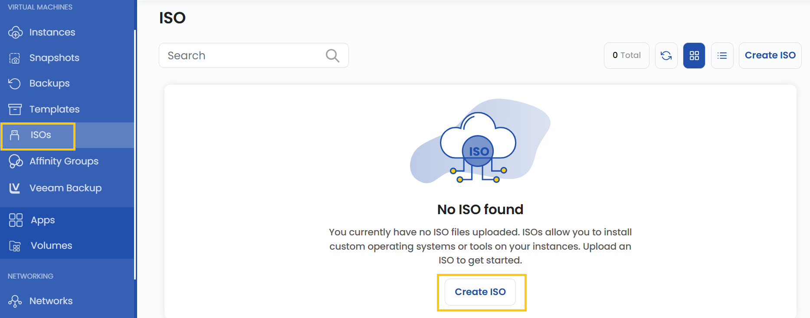
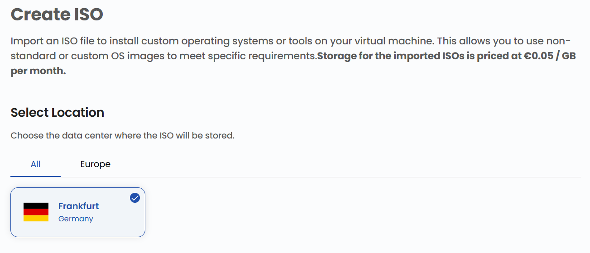
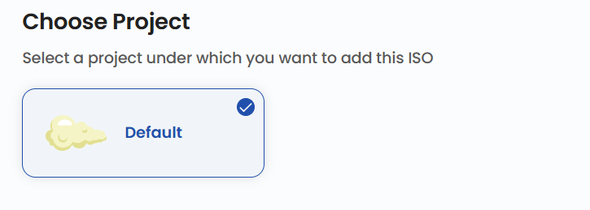
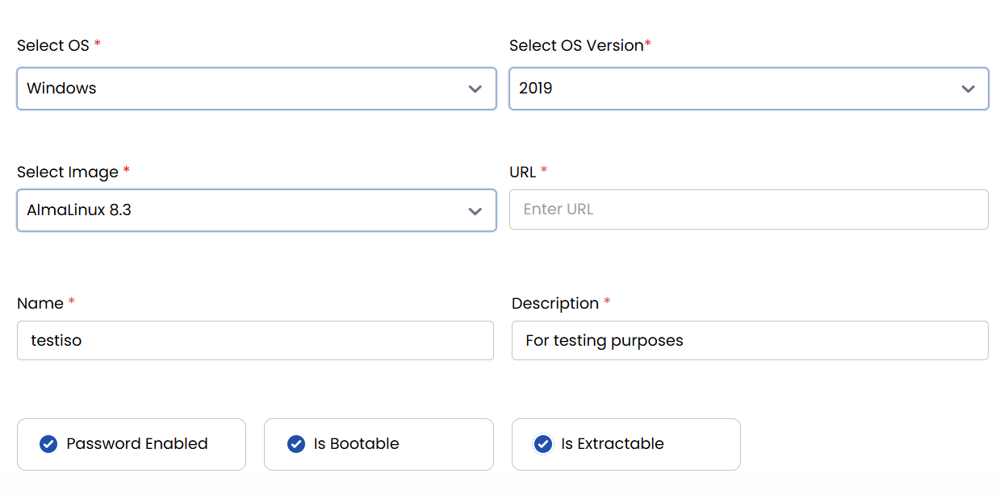

## ISO Image

An **ISO (International Organization for Standardization)** image is a disk image file that contains an exact copy of a filesystem. In Stack Console, ISO images are used to create virtual machines, install operating systems, or perform system recovery. This guide explains how to import, manage, and deploy an ISO image in Stack Console.

----

### Creating an ISO Image

- From the left-hand side menu, click on the **ISOs** tab.
- To create an ISO, click the **ISOs** or **plus (+)** icon located on the right side of the page. This will open the ISO creation menu.

### Choose a Location

- Select the data center location where your ISO will be stored.
- Choose from the available locations listed.

### Assign to a Project

- Assign the ISO to one of your projects to organize and manage resources effectively.

### ISO Details

When creating an ISO, you need to fill out the details with several required fields:

- **Operating System**: Choose the OS you want for the ISO (e.g., Windows, Linux, macOS).
- **OS Version**: Select the specific version of the chosen OS (e.g., Windows 11, Ubuntu 22.04).
- **Image**: Select the actual file that will be used to create the ISO.
- **URL**: Provide a valid URL if the ISO is hosted online.
- **Name**: Give your ISO file a name for easy identification.
- **Description**: Write a short description of what the ISO contains or its purpose.

Additionally, you can select from advanced options for the ISO:

- **Password Enabled**: If selected, the ISO will require a password to access its contents, adding an extra layer of security.
- **Is Bootable**: This determines whether the ISO can be used to boot a system. If enabled, the ISO can be written to a USB/DVD and used to install or run an OS.
- **Is Extractable**: This option allows the ISO to be opened and extracted like a normal archive without requiring special mounting software.

### Create ISO

- Choose the desired **Billing Cycle** for your ISO. You can choose either Hourly or Monthly.
- Verify all the configuration details and review the price summary. Click on **Review & Create ISO** to create the ISO for your project.

### Conclusion

By following this guide, you can easily create and manage ISO images on Stack Console. ISO images provide a versatile way to deploy operating systems, create virtual machines, or perform system recovery. For further assistance, refer to the Stack Console documentation or reach out to support.
