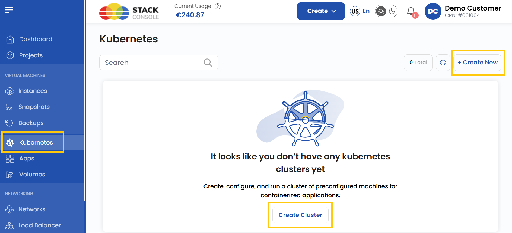
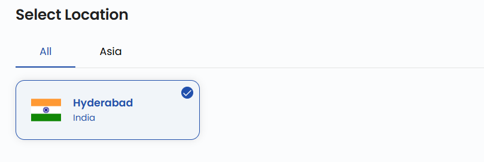
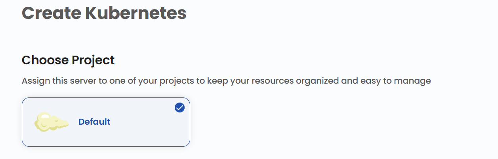
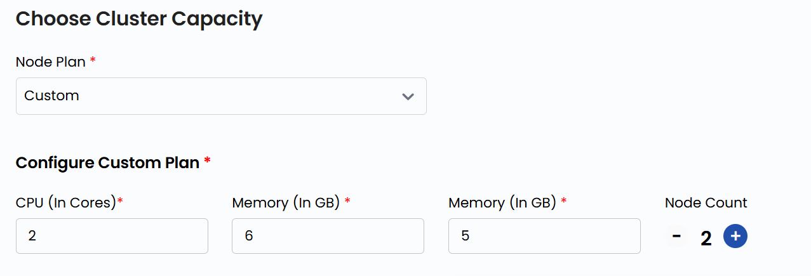
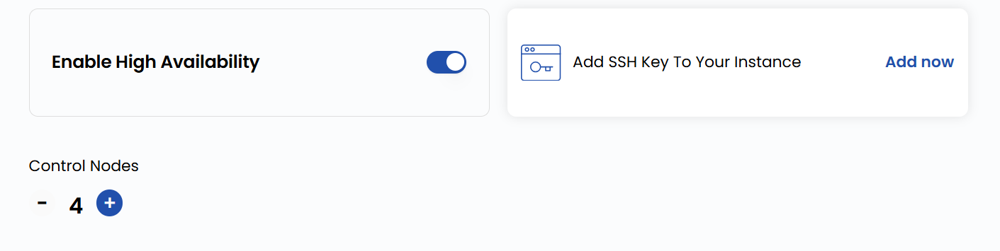
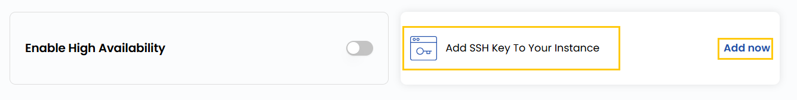
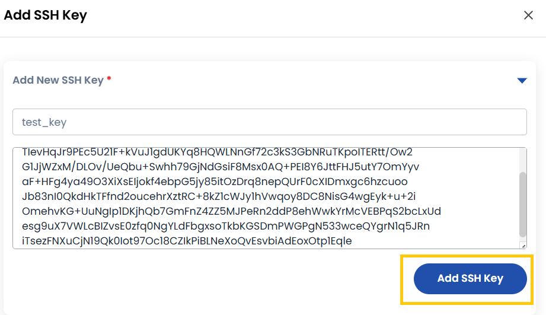
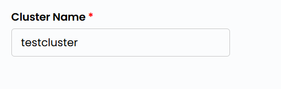
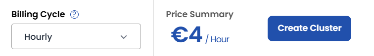

## Kubernetes Cluster

A **Kubernetes** cluster is a set of preconfigured machines (nodes) that work together to run containerized applications in an automated and scalable way. Kubernetes manages the deployment, scaling, and operation of application containers across multiple nodes.

In **Stack Console**, you can easily set up a Kubernetes cluster to manage your applications, scale resources, and maintain high availability.

----------

### Creating a Kubernetes Cluster

- From the left-hand menu, click on the **Kubernetes** tab.
- You will be redirected to the **Kubernetes** page.

- To create a cluster, click on **Create Cluster** or the **Create New** icon located on the right side of the page.

### Choose a Location

- Select the data center location where your Kubernetes cluster will be deployed.
- Choose from the available locations listed.

### Assign to a Project

- Assign the cluster server to one of your projects to organize and manage resources effectively.

### Choose Network

- Set up or choose a network for your server. This can be an isolated private network, or you can create an elastic network to connect multiple regions.
- Alternatively, you can also create or set up a new network by selecting **Create New Network**.

### Choose Cluster Capacity

- You can select the predefined **Node Plan** with fixed configurations for CPU, memory, and storage.
- For a more tailored solution, you can create a **Custom Plan** by specifying CPU, memory, storage, and node count. More nodes improve scalability and distribute workloads efficiently.

### Advanced Settings (Optional)

- You can **Enable High Availability** for better redundancy and add **Control Nodes** to ensure stability in case of failures.

- Configure additional settings for your server:
  - **Add SSH Key** for secure access. Click on **Add Now** to add an SSH key.
  - **Note**: For some OS images, such as Arch Linux, an SSH key is required because password login is not supported.

- Add the name of the SSH key with the key value and click **Add SSH Key**.

### Choose Cluster Name

- Provide a unique **Cluster Name** for your Kubernetes cluster to identify it easily in your dashboard.

### Create Cluster

- Choose the desired **Billing Cycle** for your cluster. You can choose either Hourly or Monthly.
- Verify all the configuration details and review the price summary. Click on **Create Cluster** to create the cluster.

### Conclusion

By following this guide, you can easily create and manage a Kubernetes cluster on Stack Console. Kubernetes clusters provide a powerful way to deploy, scale, and manage containerized applications with high availability and efficiency. For further assistance, refer to the Stack Console documentation or reach out to support.
