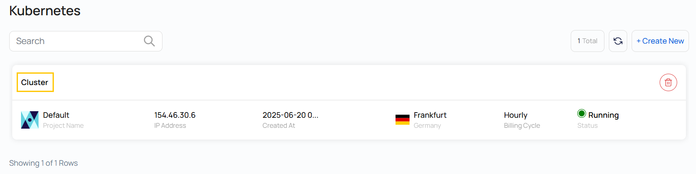
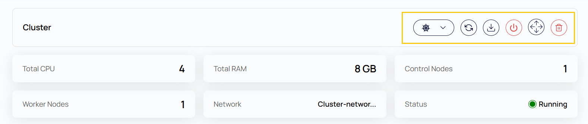
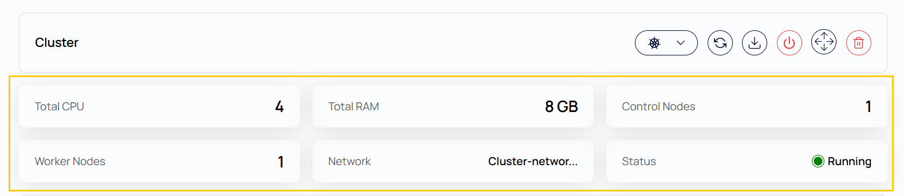
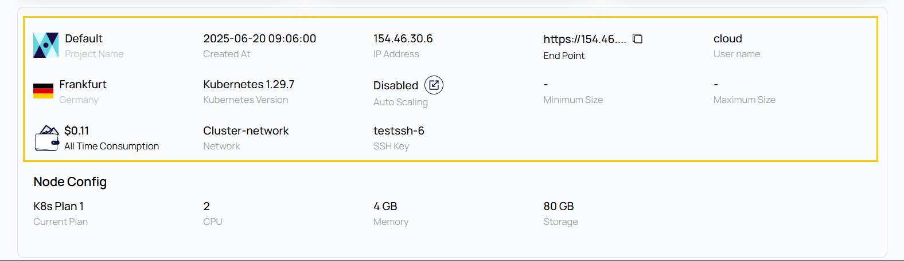
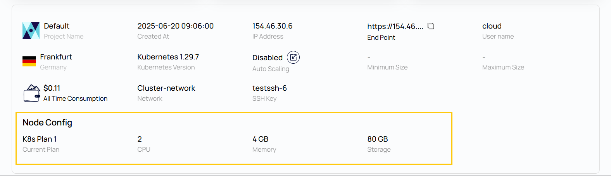
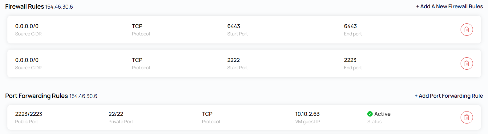

## Kubernetes Cluster Overview for Stack Console

The **Kubernetes Cluster Overview** page provides a detailed summary and management options for your Kubernetes cluster. It includes key details like cluster configuration, resource specifications, usage metrics, and quick actions to manage the cluster effectively.

----------

### Action Buttons

- Action Buttons provide shortcuts for essential Kubernetes management tasks.

- To view Action buttons, click on the cluster, which will redirect you to the **Kubernetes Cluster** page.

- **Upgrade Kubernetes Version:** Update the cluster to a newer Kubernetes release for improved features, bug fixes, and security patches.
- **Refresh:** Reloads the latest cluster data, including current status and resource metrics.
- **Download Config:** Downloads the `kubeconfig` file that allows you to interact with the cluster using CLI tools like `kubectl`.
- **Power Off:** Gracefully shuts down the entire Kubernetes cluster.
- **Delete:** Permanently deletes the cluster and all associated resources.

### Cluster Overview

- **Total CPU:** Total number of virtual CPUs (vCPUs) provisioned across all nodes in the cluster.
- **Total RAM:** The total amount of memory (in GB) allocated to the cluster.
- **Control Nodes:** Nodes responsible for managing the cluster state and coordinating worker nodes.
- **Worker Nodes:** Nodes that run the containerized workloads and applications.
- **Network:** The virtual network in which the cluster is deployed.
- **Status:** The current state of the cluster (e.g., Running, Stopped).

### Cluster Information

- **Project Name:** The name of the user-defined project under which the cluster was created.
- **Created At:** Timestamp showing when the cluster was created.
- **IP Address:** The public IP address assigned to the cluster.
- **End Point:** The API server endpoint for accessing the cluster.
- **Cloud:** The cloud region or provider where the cluster is hosted.
- **Username:** The default username for accessing cluster resources.
- **Location:** The geographic location of the data center (e.g., Frankfurt, Germany).
- **Kubernetes Version:** The current version of Kubernetes running in the cluster.
- **Auto Scaling:** If enabled, the cluster can automatically adjust the number of nodes based on workload demands.
- **Minimum Size / Maximum Size:** Defines the minimum and maximum number of nodes the auto-scaler can scale to (if enabled).
- **All Time Consumption:** Total cost of running the cluster since creation.
- **Network:** The name of the network in which the cluster is operating.
- **SSH Key:** The SSH key used to securely access the nodes in the cluster.

### Node Config

- **Current Plan:** The selected infrastructure plan defining the resource limits for each node (e.g., K8s Plan 1).
- **CPU:** Number of vCPUs allocated per node.
- **Memory:** Amount of RAM assigned per node.
- **Storage:** Disk storage capacity available to each node.

### Check the Kubernetes service

The services will be running on port. Open the same port in the firewall on the portal & also created a port forwarding rule for the same from the portal as shown in the screenshot below.

----------

### Conclusion

The **Kubernetes Cluster Overview** page gives a centralized view of your cluster’s health, configuration, and resource usage. Action buttons simplify cluster maintenance, and detailed specs help with monitoring and planning. 

:::tip
**See also:**  
- **[Create Kubernetes Cluster](./Create%20Kubernetes%20Cluster.md)**
- **[Kubernetes Cluster CLI](./Kubernetes%20Cluster%20via%20CLI.md)**
- **[Kubernetes Cluster UI Access](./Kubernetes%20Dashboard%20UI%20Access.md)**
:::

