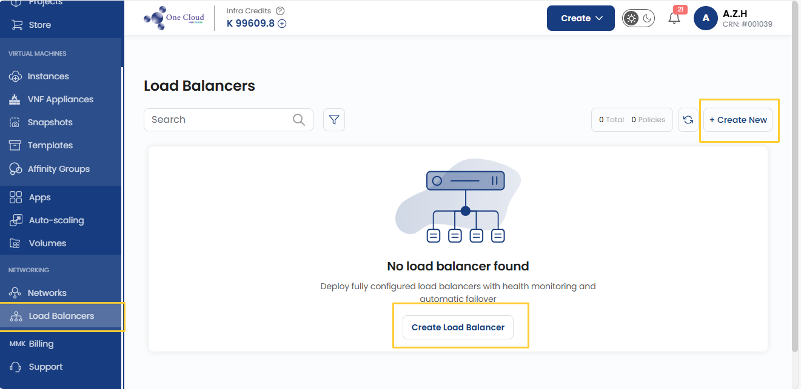
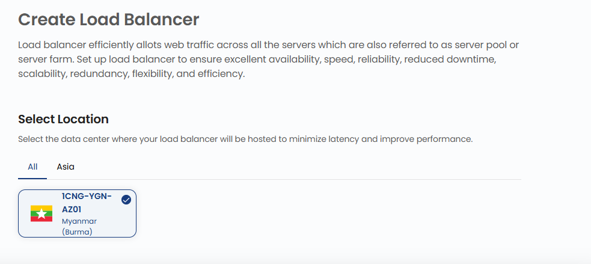
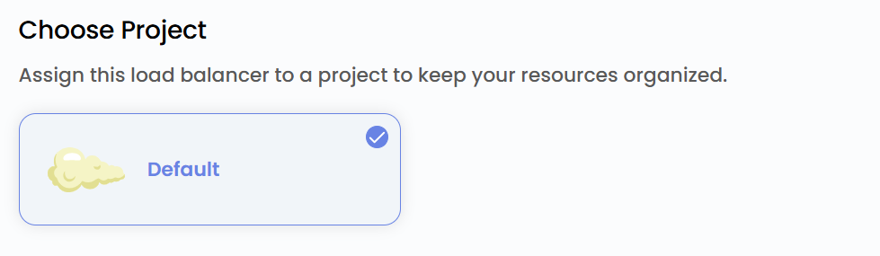
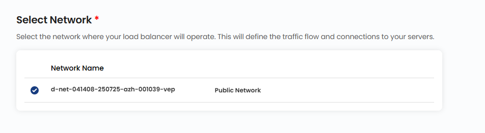
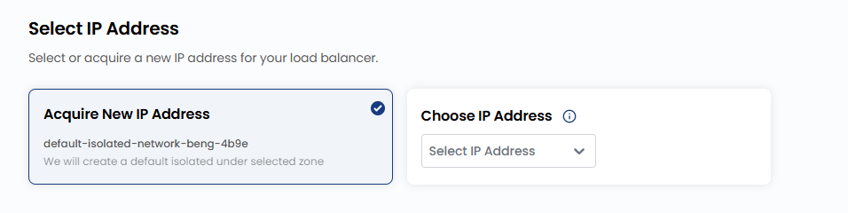
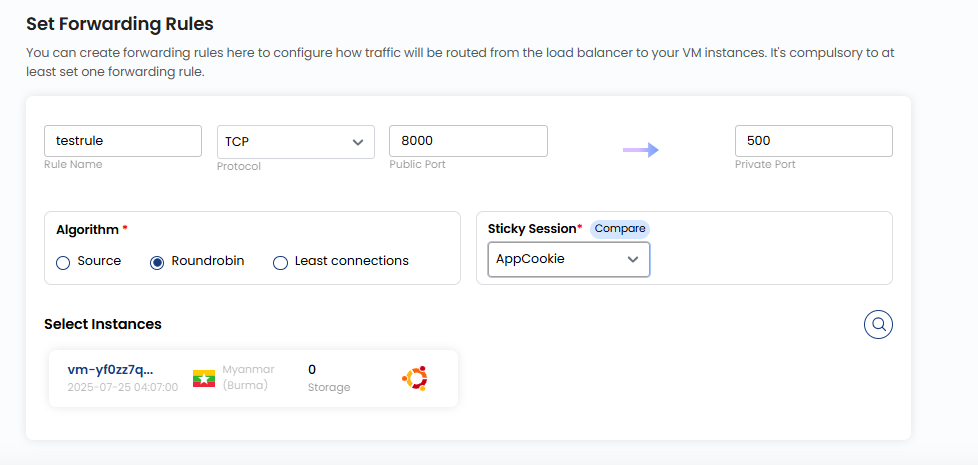
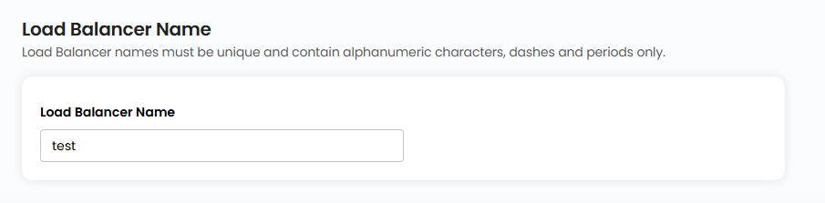
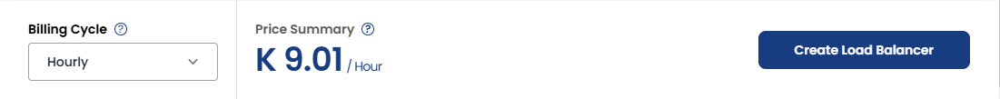
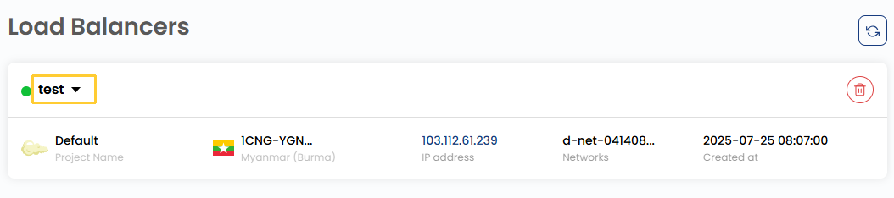
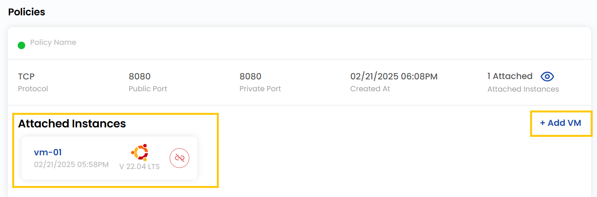

## Load Balancer

A **Load Balancer** helps distribute incoming traffic across multiple servers to ensure high availability, reliability, and improved performance. In 1CNG, you can set up a Load Balancer to handle web applications, databases, and other services efficiently. This guide will walk you through the steps to configure a Load Balancer in 1CNG.

---

### Creating a Load Balancer

- From the left-hand side menu, click on the **Load Balancer** tab.
- To create a load balancer, click the **Load Balancer** or **plus (+)** icon located on the right side of the page. This will open the load balancer creation menu.

### Choose a Location

- Select the data center location where your server will be physically hosted.
- Choose from the available locations listed.

### Assign to a Project

- Assign the load balancer to one of your projects to organize and manage resources effectively.

### Choose Network

- Select the network where your load balancer will operate. This will define the traffic flow and connections to your servers.

### Choose IP

- Choose the network IP for your load balancer by selecting from **Existing IP Address** or **Acquire New IP Address**.
- **Note**: By choosing **Acquire New IP**, it will create a default isolated IP under the selected zone.

### Set Forwarding Rules

- Configure forwarding rules to define how traffic should be distributed across your servers.
- Provide a unique **Rule Name** for the forwarding rule. Choose the appropriate **Protocol** (e.g., TCP, UDP, HTTP, HTTPS). 
 Specify the port range for incoming traffic.
- Select an algorithm to distribute incoming requests among instances:
    - **Source** – Directs traffic to the same instance based on the client’s source IP.
    - **Round Robin** – Distributes traffic evenly across all available instances.
    - **Least Connections** – Sends traffic to the instance with the fewest active connections.

- You can enable **Sticky sessions** ensure that a user’s requests are consistently routed to the same backend instance.
    - **LB Cookie** – Uses a load balancer-generated cookie to maintain session persistence.
    - **App Cookie** – Uses application-defined cookies for session persistence.
    - **Source-Based** – Binds sessions to a backend instance based on the client’s source IP.
    - **None** – No session persistence; requests are distributed normally.
- Choose the VM instances that will handle incoming traffic.

### Name Load Balancer

- Provide a unique name for your load balancer to easily identify it. The name can only include alphanumeric characters, dashes, and periods.

### Create Load Balancer

- Choose the desired **Billing Cycle** for your load balancer. Load Balancer supports Hourly, Monthly, Quarterly, Semiannually, Yearly, Bi-annually, and Tri-annually billing cycles.
-  The billing rules it supports include Date to Date, Fixed Calendar Month, Unfixed Calendar Month, Fixed Prorata, and Unfixed Prorata.
- Only one load balancer package is available per zone. This simplifies configuration and ensures consistent behavior within each deployment zone.
- Verify all the configuration details and review the price summary. Click on **Create Load Balancer** to create the load balancer for your network.

### View Load Balancer

- To view more about load balancer in detail, click on the Load Balancer. 

- You can view the policies associated with this load balancer. 
- If you want to attach a VM instance to your load balancer you can go to **Add VM** and select the VM instance to attach.

### Conclusion

By following this guide, you can easily configure and manage a Load Balancer on 1CNG. Load Balancers ensure high availability, reliability, and improved performance by distributing incoming traffic across multiple servers. For further assistance, refer to the 1CNG documentation or reach out to support.

:::tip
**See also:**  
- **[Public Network](./../Networks/Guides%20For%20Apache%20CloudStack/Public%20Network/Create%20Public%20Network.md)**
- **[VPC Network](./../Networks/Guides%20For%20Apache%20CloudStack/VPC%20Network/Create%20VPC%20Network.md)**
- **[Affinity Group ](../Affinity%20Groups/Create%20Affinity%20Groups.md)**
- **[Public IP Address](../Networks/Guides%20For%20Apache%20CloudStack/Public%20IP%20Address.md)**
- **[Create Templates](../Templates/Create%20Templates.md)**

:::
