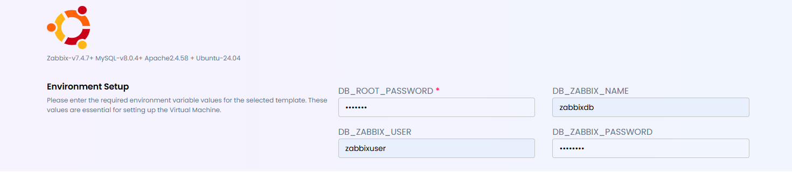

### Overview

This guide provides instructions for deploying and using the Zabbix monitoring application from the marketplace.

The deployment is pre-configured with a stable LAMP stack and allows users to customize database credentials during setup.

### System Environment

#### Base Operating System

- Ubuntu 24.04

#### Pre-installed Components

- Zabbix Server + Frontend
- MySQL Server 8.0.4
- Apache 2.4.58
- PHP (required for Zabbix frontend)

### What is Zabbix?

#### Zabbix is an enterprise-grade monitoring solution used to track:

- Servers and VMs
- Network devices
- Applications and services
- Databases

#### Key Features
- Web-based dashboard
- Real-time monitoring
- Alerting & notifications
- Agent-based and agentless monitoring

### User Configuration Variables

#### During deployment, users can define the following variables:

**DB_ROOT_PASS:** MySQL root password and it is mandatory.  
**DB_ZBX_NAME:** Zabbix database name   
**DB_ZBX_USER:** Zabbix databse username   
**DB_ZBX_PASSWORD:** Zabbix database password

#### Default Behavior
If optional variables are not provided, the system will automatically assign:

| Variable | Default Value |
| :--- | :--- |
| DB_ZBX_NAME | zabbix |
| DB_ZBX_USER | zabbix |
| DB_ZBX_PASSWD | zabbix |

Example:

### Accessing Zabbix Web Interface

Open browser and go to: `https://<your-server-ip>/zabbix `

**Default Login**

Username: Admin   
Password: zabbix

⚠️ Change the default password after first login.

### Security Recommendations

- User strong database passwords
- Change default Zabbix admin password
- Restrict access to web UI (firewall or VPN)

### Summary

This marketplace deployment provides:
- Pre-configured Zabbix monitoring stack
- Ubuntu 24.04 base system
- MySQL + Apache integration
- Flexible database configuration via user variables

Users are required to define only the MySQL root password, while other values default to zabbix, ensuring a quick and easy setup.
