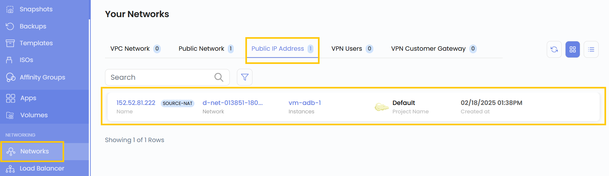
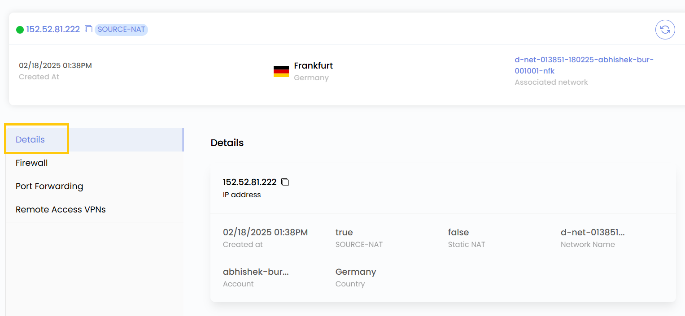
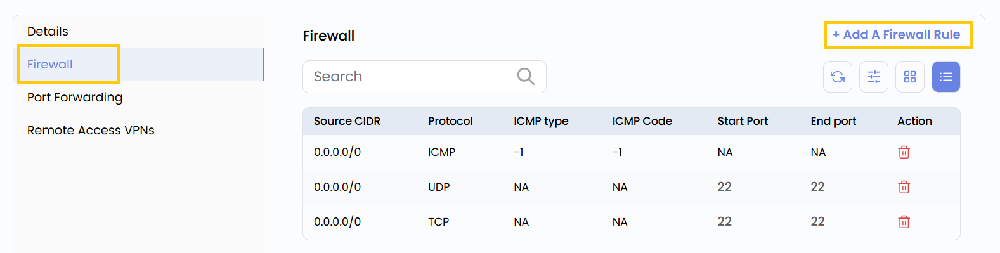
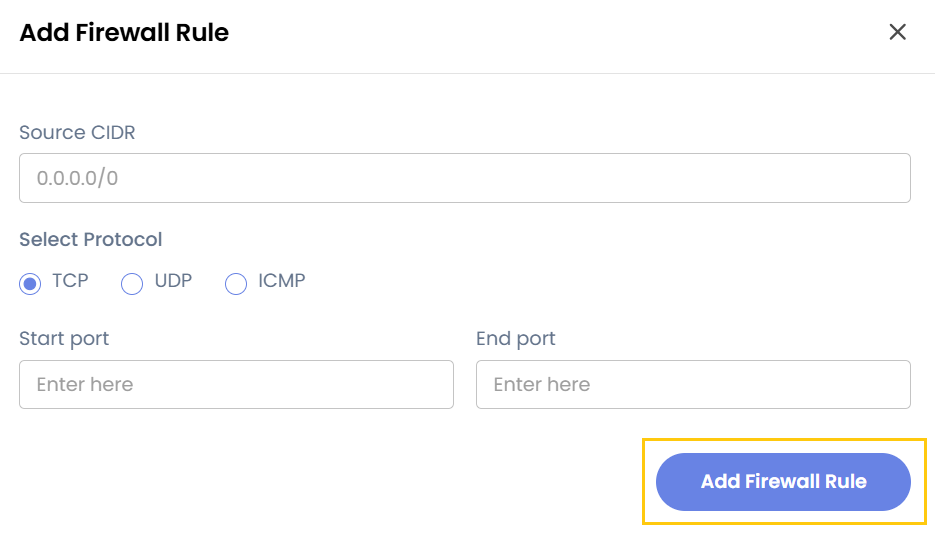
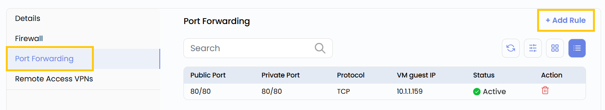
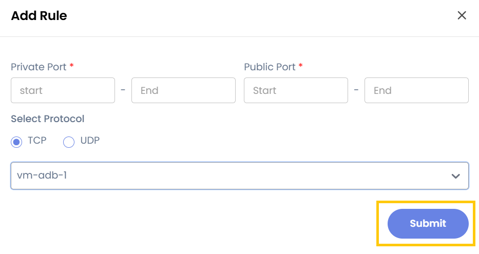
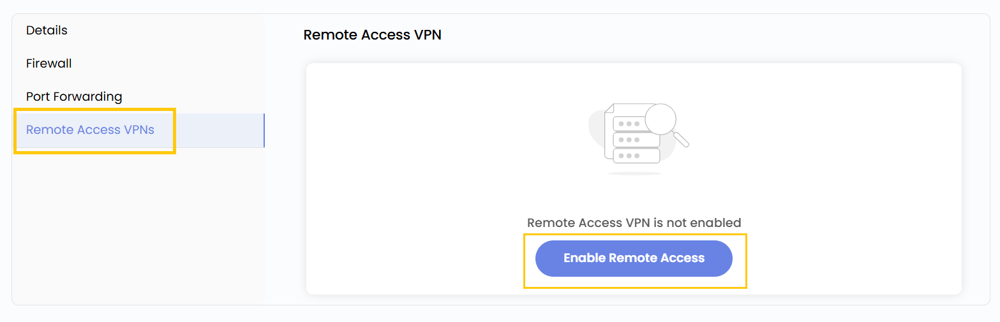

A **Public IP** in Stack Console is an internet-facing IP address assigned to cloud resources, allowing them to be accessible from outside the private network. Public IPs are essential for web servers, APIs, and other services requiring direct internet access.

-----

- From the left-hand menu, click on the **Networks** tab.
- You will be redirected to the **Networks** page. Go to the **Public IP Address** tab where you will see the Public IPs listed.

### Public IP Details

- To view more detail, click on the public ip instance.
- From Details tab you can view the deatils like ip address, network name, account details, country zone.

### Add Firewall Rule

- Go to **Firewall** tab you will see firewall rules which have been set before. 
- To add firewall rule click on **Add Firewall Rule**.

- Add source CIDR, and select protocol from TCP, UDP, ICMP.
- Add the Start and Endport and click on **Add Firewall Rule**.

### Add Port Forwarding Rule

- Go to **Port Forwarding** tab you will see port forwarding rules which have been set before. 
- To add port forwarding rule click on **Add Rule**.

- **Private Port Range (Start - End)**: This defines the port range on your internal (private) network where traffic will be forwarded.
- **Public Port Range (Start - End)**: This defines the external (public) ports that will be accessible from the internet.
- **Protocol**: Choose TCP, UDP, or Both depending on the service requirements.
- **Instance**: Select the VM instance device that will receive the forwarded traffic.
- Click on **Submit** to save and create the rule.

### Enable Remote Access VPN

- Go to **Remote Access VPNs** tab you will see option to set remote access VPN.
- If you need secure remote access to the private network, click on **Enable Remote Access** VPN to activate a VPN connection.

