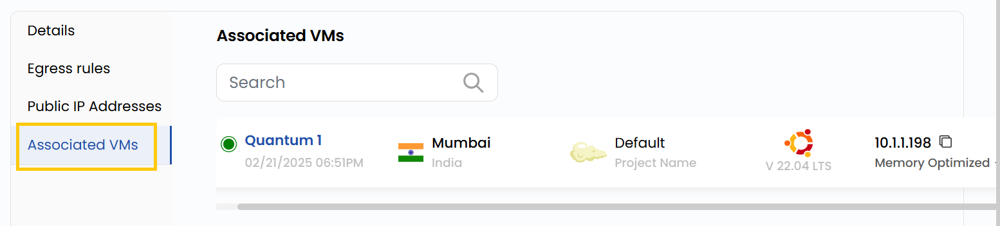

## Associated VMs

The **Associated VMs** tab lists all running VMs instances connected to the public network.

### Conclusion

The Associated VMs tab provides a clear overview of all VM instances connected to the public network, making it easier to monitor, organize, and manage active resources efficiently.