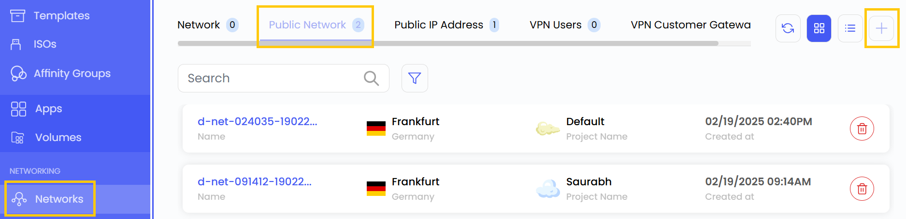
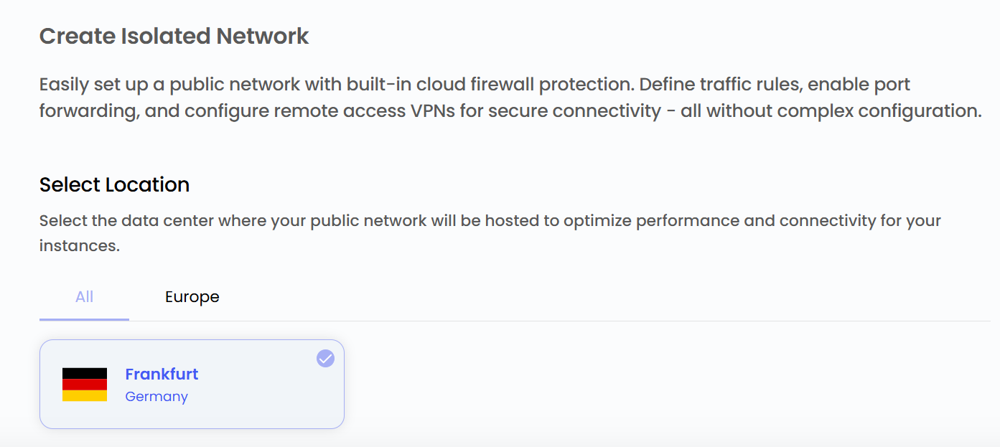
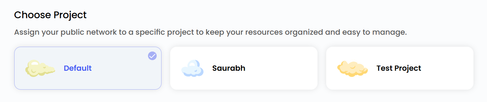
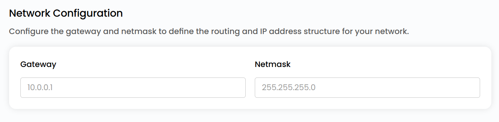
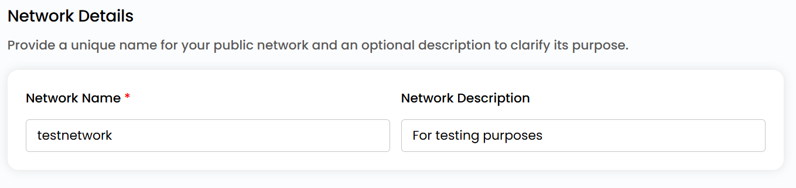
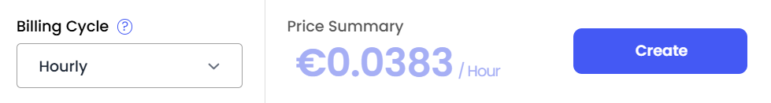

**Public Network** in Stack Console is used to provide internet-facing access to cloud resources. It allows virtual machines, applications, and other cloud services to communicate with external systems over the internet. Public networks are essential for hosting web applications, APIs, and other services that require global accessibility.

- From the left-hand menu, click on the **Networks** tab.
- You will be redirected to the **Networks** page. Go to the **Public Network** tab.

- To create public network click the **plus (+)** icon located on the right side of the networks page.

### Choose a Location

- Select the data center location where your server will be physically hosted.
- Choose from the available locations listed.

### Assign to a Project

- You can choose projects to assign the server to one of your projects to organize and manage resources effectively.

### Network Configurations

- Configure the gateway and network mask to define the routing and IP address structure for your network.

### Choose Public Network Name

- Provide a unique name for your Public Network to easily identify it, and optionally, add a description to clarify its purpose.

### Create Public Network

- Choose the desired **Billing Cycle** for your public Network. You can choose either Hourly or Monthly cycle.
- Verify all the configuration details and review the price summary. Click on **Create** to create the public network.    

